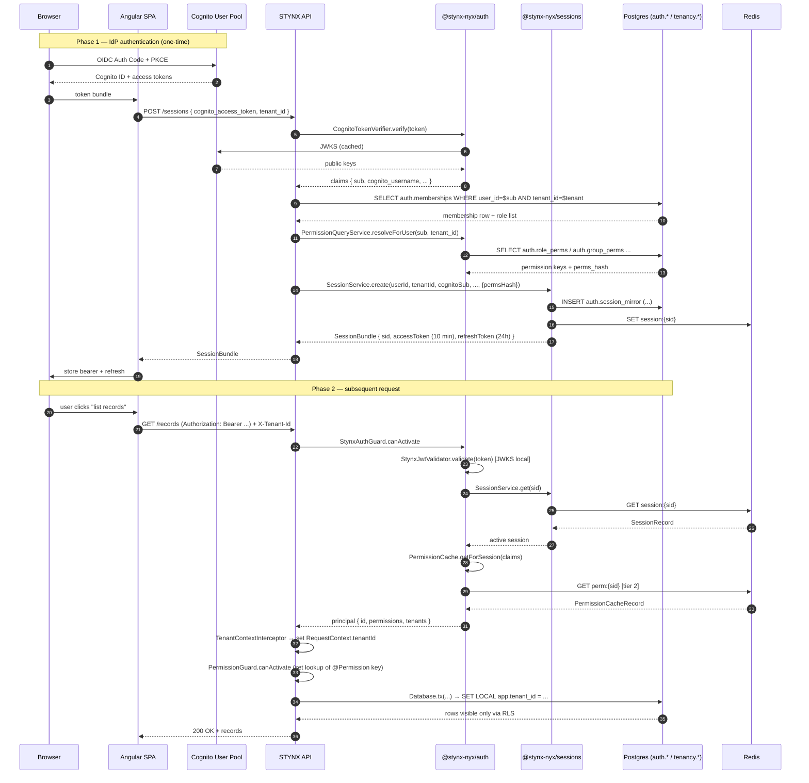

# 07 — Auth and Tenancy Patterns

> **Audience.** Coding agents porting a foreign repo onto STYNX.
> **Spec baseline.** `STYNX-SPEC-v0.6.md` §4 (tenancy), §5 (sessions),
> §6 (authz). ADR-002 for the permission cache. GAP-004 for tenant
> exchange. Discovery commit `670d165`.
>
> **Use this file when:** wiring `@stynx-nyx/auth` + `@stynx-nyx/sessions` +
> `@stynx-nyx/tenancy` into an app that already has _some_ form of auth.
>
> Every snippet cites a concrete `path:line` from this repo. Anything
> the discovery pass could not confirm is marked `[GAP — …]`.

---

## How to read this file

Each pattern below answers four questions in the same order:

1. **What it replaces** in the foreign codebase.
2. **Which `@stynx-nyx/*` packages compose** the new surface.
3. **A minimum-effort migration recipe** (numbered steps).
4. **A code citation** that proves the pattern is real in this repo.

The patterns are not independent — Pattern A (replace JWT middleware)
must land before Pattern B (introduce TenantContext) because the
tenancy interceptor reads `request.stynxClaims` set by the auth guard
(`packages/tenancy/src/tenant-context.interceptor.ts:76`).

The recommended ordering is **A → B → C → F → G → D → E**.
Pattern E is informational only — impersonation is not in v1.0.

---

## Pattern A — Replacing existing JWT middleware

### A.0 What you are replacing

The vast majority of foreign Node.js APIs reach for one of these:

| Starting stack                  | Typical entry point                                                          | What it does                                  |
| ------------------------------- | ---------------------------------------------------------------------------- | --------------------------------------------- |
| **Passport JWT**                | `passport.use(new JwtStrategy({...}))`                                       | Verifies a bearer JWT and attaches `req.user` |
| **Custom JWT (`jsonwebtoken`)** | `jwt.verify(token, secret)` in middleware                                    | Same, but bespoke                             |
| **Auth0 SDK**                   | `express-oauth2-jwt-bearer` `auth({...})`                                    | JWKS-backed JWT verify against Auth0          |
| **Clerk SDK**                   | `ClerkExpressRequireAuth()`                                                  | JWT verify + `req.auth = {userId, orgId}`     |
| **AWS Cognito (direct)**        | `@aws-sdk/client-cognito-identity-provider` calls or hand-rolled JWKS verify | Verify Cognito access token directly          |

STYNX replaces all five with the **same two-guard pipeline**:

```
StynxAuthGuard  → verifies STYNX bearer JWT, hydrates principal/perms
PermissionGuard → checks @Permission(...) metadata
```

`StynxAuthGuard` is at `packages/auth/src/stynx-auth.guard.ts:25–82`.
`PermissionGuard` is at `packages/auth/src/permission.guard.ts:11–38`.
The reference app wires them per-controller via
`@UseGuards(StynxAuthGuard, PermissionGuard)`
(`reference/api/src/sample/records.controller.ts:49`).

### A.1 What `@stynx-nyx/auth` actually is

- A NestJS module: `StynxAuthModule.forRoot({...})`
  (`reference/api/src/app.module.ts:180–195`).
- Two guards that ship together:
  `StynxAuthGuard` (verify bearer + hydrate `request.principal`) and
  `PermissionGuard` (check `@Permission(key)` metadata).
- Two JWT validators:
  - `StynxJwtValidator` — verifies STYNX-issued bearer tokens (the
    happy path for any logged-in user).
  - `CognitoJwtValidator` / `CognitoTokenVerifier` — verifies the
    upstream Cognito access token at the **session-creation boundary
    only** (`POST /sessions` exchange; not on every request).
- A three-tier `PermissionCache` (in-process LRU → Redis →
  Postgres). See `packages/auth/src/permission-cache.ts:67–131`.

The crucial architectural point: STYNX **does not verify the Cognito
token on every request**. Cognito is the IdP at session creation. After
that, every request carries a STYNX bearer JWT signed with STYNX's own
RSA keypair (JWKS at `/.well-known/jwks.json`, served by
`packages/sessions/src/jwks.controller.ts`). This is what
`StynxJwtValidator` validates at
`packages/auth/src/stynx-auth.guard.ts:50`.

### A.2 Recipe — Passport JWT → STYNX

Minimum-effort migration assuming a typical Express + Passport app:

1. **Remove** `passport`, `passport-jwt`, and any
   `app.use(passport.initialize())`/`passport.authenticate('jwt', ...)`
   middleware.
2. **Install** `@stynx-nyx/auth`, `@stynx-nyx/sessions`, `@stynx-nyx/data`,
   `@stynx-nyx/core`, `@stynx-nyx/backend` (peer-dep set per
   `docs/stynx/porting-pack/05-PACKAGE-CATALOG.md`).
3. **Convert** the host app to NestJS _or_ keep the existing HTTP layer
   and call `StynxJwtValidator.validate(token)` inside your existing
   middleware (it returns the typed claims; from there you populate
   `request.principal` yourself).
   - Cited in `packages/auth/src/stynx-auth.guard.ts:50`:
     `const claims = await this.validator.validate(token);`
4. **Replace** every place that read `req.user.id` with the STYNX
   shape: `request.principal.id` and `request.principal.permissions`
   (set in `packages/auth/src/stynx-auth.guard.ts:65–71`).
5. **Wire** `StynxAuthModule.forRoot({ stynx: {issuer}, cognito:
{issuer, jwksUri} })` exactly as
   `reference/api/src/app.module.ts:180–195`.

If the foreign app's `req.user.permissions` was a flat string array,
the shape is already compatible — `permissions` in
`packages/auth/src/stynx-auth.guard.ts:68` is `string[]`.

### A.3 Recipe — Custom JWT (`jsonwebtoken`) → STYNX

1. **Identify** every call to `jwt.sign(...)`. There should be exactly
   one in a healthy codebase — the login endpoint.
2. **Replace** the login endpoint with a session-creation flow:
   - Verify the upstream credential (e.g. Cognito access token) with
     `CognitoTokenVerifier`
     (`packages/auth/src/cognito-token-verifier.ts`).
   - Call `SessionService.create(userId, tenantId, cognitoSub, …)`
     (`packages/sessions/src/session.service.ts:57–100`). It returns a
     `SessionBundle { sid, accessToken, refreshToken, expiresAt }`.
3. **Identify** every call to `jwt.verify(...)`. Replace with
   `StynxAuthGuard` mounted globally (or per-controller via
   `@UseGuards(StynxAuthGuard, PermissionGuard)`).
4. **Delete** the bespoke secret-loading code. STYNX uses an asymmetric
   keypair (RSA), JWKS-published. Key set is configured via
   `STYNX_SESSION_KEY_SET_JSON`
   (`reference/api/src/app.module.ts:43–49`).
5. **Note:** STYNX bearer JWT lifetime is 10 min, refresh 24h sliding
   (`tenancy-model.md` §5.2). If the foreign app used long-lived JWTs,
   the new contract requires a refresh round-trip — clients must call
   `SessionService.refresh(refreshToken)`
   (`packages/sessions/src/session.service.ts:102–138`).

### A.4 Recipe — Auth0 → STYNX

Auth0 substitution is more involved because Auth0 conflates IdP and
session manager. STYNX splits them: Cognito does IdP, STYNX issues
sessions.

1. **Decide** whether Auth0 is being replaced by Cognito (recommended;
   STYNX's tested IdP per `tenancy-model.md` §5.1) or kept as a
   federated IdP behind Cognito (Cognito supports OIDC federation —
   `[GAP — federated-IdP-via-Cognito wiring example not present in
this repo's reference app]`).
2. **Remove** `express-oauth2-jwt-bearer`, `express-openid-connect`,
   and any Auth0-specific role/permission middleware. Auth0 RBAC
   (delegated authz) does not survive — STYNX permissions live in
   `auth.perms`/`auth.role_perms` (Pattern C).
3. **Map** Auth0's `permissions` claim to STYNX permission keys (see
   §C). Auth0 permissions like `read:documents` become
   `document:read:*` in STYNX (note the colon-with-scope shape).
4. **Wire** as in A.2 step 5 above.
5. **Migrate** Auth0 tenant ("Organization") metadata to
   `tenancy.tenants` (Pattern B + §C seeding).

### A.5 Recipe — Clerk → STYNX

Clerk's organization model maps roughly to STYNX tenants:

| Clerk concept             | STYNX concept          |
| ------------------------- | ---------------------- |
| `User`                    | `auth.users`           |
| `Organization`            | `tenancy.tenants`      |
| `Organization Membership` | `auth.memberships`     |
| `Role`                    | `auth.roles`           |
| `Permission` (Clerk Pro)  | `auth.perms`           |
| `req.auth.userId`         | `request.principal.id` |
| `req.auth.orgId`          | `request.tenantId`     |

1. **Remove** `@clerk/clerk-sdk-node`,
   `@clerk/clerk-express`, all `ClerkExpressRequireAuth` middleware.
2. **Reissue** sessions on first request after deploy: there is no way
   to verify a Clerk-issued JWT with STYNX's keypair. Force a
   re-login.
3. **Map** Clerk org IDs to STYNX `tenant_id` UUIDv7s (the tenancy
   interceptor rejects non-UUIDv7 candidates at
   `packages/tenancy/src/tenant-context.interceptor.ts:88`).
4. **Wire** as in A.2.

### A.6 Recipe — Cognito-direct → STYNX

This is the smallest delta — STYNX's IdP layer **is** Cognito.

1. **Keep** the User Pool, app client, callback URLs.
2. **Remove** any direct `@aws-sdk/client-cognito-identity-provider`
   calls outside `@stynx-nyx/auth`'s `CognitoAdminAdapter`
   (`packages/auth/src/cognito-admin.adapter.ts`).
3. **Add** the session-exchange endpoint: client posts the Cognito
   access token to `POST /sessions`, gets back a STYNX bearer + refresh.
4. **Replace** runtime Cognito-JWT verification with STYNX bearer
   verification (the guard in
   `packages/auth/src/stynx-auth.guard.ts:50`). `CognitoTokenVerifier`
   stays in the codebase but only fires at session creation.
5. **Wire** as in A.2.

### A.7 Cross-stack invariants (apply to all five recipes)

- **No raw `pg` connections** (Invariant I1, see
  `04-INVARIANTS-AND-CONTRACTS.md`). Auth-related DB queries go through
  `Database.tx(...)` (cited in
  `packages/tenancy/src/tenant-context.interceptor.ts:127`).
- **Every HTTP route declares its perm or opt-out** (Invariant I4):
  `@Permission('...')`, `@Public()`, or `@System()`. Enforced at CI by
  `stynx doctor` (`packages/cli/src/doctor.ts`).
- **Bearer claims are typed** (`StynxAccessTokenClaims` in
  `packages/auth/src/types.ts` — referenced from
  `packages/auth/src/permission-cache.ts:11`).
- **The auth guard sets `request.tenantId` only as a hint**; the
  authoritative tenant comes from the tenancy interceptor in Pattern B
  (`packages/auth/src/stynx-auth.guard.ts:61`,
  `packages/tenancy/src/tenant-context.interceptor.ts:106`).

### A.8 Decorator-equivalence cheat-sheet

| Foreign decorator/middleware         | STYNX replacement                                                                              |
| ------------------------------------ | ---------------------------------------------------------------------------------------------- |
| `passport.authenticate('jwt')`       | global `StynxAuthGuard`                                                                        |
| `@UseGuards(JwtAuthGuard)`           | `@UseGuards(StynxAuthGuard, PermissionGuard)`                                                  |
| `@Roles('admin')` (any custom guard) | `@Permission('resource:action:scope')`                                                         |
| `requiresAuth()` (Auth0)             | omit; `StynxAuthGuard` enforces by default                                                     |
| `optionalAuth()` (Auth0/custom)      | `@Public()` (decorators.ts:8)                                                                  |
| `app.get('/healthz', ...)` no auth   | `@Public()` on the route handler                                                               |
| `cron.schedule(...)` calling DB      | wrap with `withSystemContext('cron-name', fn)` and `@System()` if exposed via HTTP (Pattern G) |

Cited file: `packages/auth/src/decorators.ts` (entire file, 23 lines —
the four decorators are at lines 8/12/16/20).

---

## Pattern B — Introducing TenantContext

### B.0 What you are replacing

The single most common multi-tenancy pattern in legacy codebases is:

```ts
// LEGACY
const records = await db.query('SELECT * FROM record WHERE org_id = $1 AND deleted_at IS NULL', [
  req.user.orgId,
]);
```

There are three problems:

1. The `WHERE org_id = $1` predicate is a programmer responsibility —
   forget it once and you have a tenant-leak.
2. The `deleted_at IS NULL` predicate is also a programmer
   responsibility — forget it once and you serve tombstones (Invariant
   I8 forbids this column on live tables).
3. There is no enforcement at the DB layer. A SQL injection or a wrong
   ORM include can cross tenant boundaries silently.

STYNX fixes all three with one mechanism: **the database does it,
because the GUC is set on every transaction and RLS reads the GUC**.

### B.1 What `@stynx-nyx/tenancy` actually is

- `StynxTenancyModule` — NestJS module
  (`packages/tenancy/src/tenancy.module.ts`, see also
  `reference/api/src/app.module.ts:205`).
- `TenantContextInterceptor` — runs _after_ `StynxAuthGuard`, resolves
  the tenant per `tenancy-model.md` §4.2 order
  (header → claim → subdomain), validates membership, then mutates
  the `RequestContext` so all DB calls see `tenantId`.
  Cited in `packages/tenancy/src/tenant-context.interceptor.ts:38–63`.
- `MembershipAccessCache` — in-memory cache fronting the
  `auth.memberships` table; the interceptor calls
  `membershipCache.get(userId, tenantId)` at line 118.
- `TenancyPlatformAdminGuard` — gates `@System()` routes that need
  platform-ops scope.

### B.2 What `@stynx-nyx/data` does with the GUC

`Database.tx(...)` is the only sanctioned DB entry point (Invariant
I1). On entry it issues:

```sql
SET LOCAL app.tenant_id  = '...';
SET LOCAL app.actor_id   = '...';
SET LOCAL app.request_id = '...';
SET LOCAL app.session_id = '...';
SET LOCAL app.role       = 'app' | 'reader' | 'owner';
```

(`tenancy-model.md` §4.4, lines 87–96.)

Every tenant-scoped table has a `tenant_isolation` policy that reads
`current_setting('app.tenant_id', true)::uuid` (`tenancy-model.md`
lines 66–69). The application code never writes
`WHERE tenant_id = $X` again.

### B.3 Recipe — "filter by org_id manually" → RLS

Adopt exactly the four steps from `tenancy-model.md` lines 166–173:

1. **Rename** the column to `tenant_id` in a single migration
   (or add it alongside, backfill, drop the old). Use UUIDv7 (the
   tenancy interceptor enforces this at
   `packages/tenancy/src/tenant-context.interceptor.ts:88`).
2. **Enable RLS:**
   ```sql
   ALTER TABLE <schema>.<table> ENABLE ROW LEVEL SECURITY;
   ALTER TABLE <schema>.<table> FORCE ROW LEVEL SECURITY;
   CREATE POLICY tenant_isolation ON <schema>.<table>
     FOR ALL
     USING      (tenant_id = current_setting('app.tenant_id', true)::uuid)
     WITH CHECK (tenant_id = current_setting('app.tenant_id', true)::uuid);
   ```
   (Verbatim shape from `tenancy-model.md:66–70`.)
3. **Delete** every `WHERE tenant_id = $X` predicate from
   application code. The migration `data.create_soft_deletable_table`
   helper sets the policy automatically — see PORT-08 for the helper
   signature; for hand-rolled tables, the snippet above is the entire
   contract.
4. **Wire** `StynxTenancyModule.forRoot({})` into the app module
   (`reference/api/src/app.module.ts:205`). Nothing else: the
   interceptor is registered globally by the module, and it runs
   automatically on every request.

The tenancy interceptor calls `Database.withSystemContext(...)` to
validate membership without setting a tenant GUC (it has no tenant
yet — that is what it is computing). See
`packages/tenancy/src/tenant-context.interceptor.ts:124–146`.

### B.4 Common pitfalls when porting B

| Pitfall                                  | Symptom                                                           | Fix                                                                                                             |
| ---------------------------------------- | ----------------------------------------------------------------- | --------------------------------------------------------------------------------------------------------------- |
| Background job calls `db.query` directly | RLS evaluates against `NULL`, silent zero rows or exception       | Wrap in `withSystemContext('reason', fn)` (Pattern G)                                                           |
| `tenant_id` is `bigint` not `uuid`       | Tenancy interceptor rejects with `BadRequestException` at line 89 | Migrate column to `uuid`, generate UUIDv7 from old keys                                                         |
| Membership not seeded                    | `TENANT_ACCESS_DENIED` ForbiddenException at line 103             | Insert into `auth.memberships` with `is_active = true` and matching tenant `is_active = true` (line 137–139)    |
| Mixed mode: header tenant ≠ claim tenant | `TENANT_ACCESS_DENIED` at line 92–94                              | Pick one: either send `X-Tenant-Id` header consistently, or never                                               |
| Subdomain tenant resolution fails        | undefined tenantId, request rejected                              | Pass `allowSubdomain: true` and a regex into `StynxTenancyModule.forRoot({ allowSubdomain, subdomainPattern })` |

### B.5 The `RequestContext` shape (what the interceptor mutates)

`packages/tenancy/src/tenant-context.interceptor.ts:45–51`:

```ts
const current = this.requestContext.snapshot();
const nextState = {
  ...current,
  ...(tenantId !== undefined ? { tenantId } : {}),
};
this.requestContextMutator.runWithRequestContext(nextState, () => { ... });
```

`RequestContext` is from `@stynx-nyx/core`. Anything inside the request
that calls `Database.tx(...)` reads it via `nestjs-cls`. Out-of-band
work (cron, queue handlers) cannot use it — see Pattern G.

---

## Pattern C — Declaring permissions

### C.0 The naming convention

Per `permission-model.md` lines 8–22:

```
resource:action:scope
```

Examples from the spec:

```
document:read:*
document:read:own
document:write:*
document:delete:*       -- soft delete
document:hard_delete:*
document:restore:*
document:read_trash:*
```

`scope` is one of `*` (any), `own` (resource owned by the actor), or
`[GAP — additional scope tokens not enumerated in spec; reference app
uses two-segment keys instead, see C.4]`.

**No ABAC.** No relationship-based authz. No policy hooks. Wildcards
expand at cache build time; runtime check is an O(1) hash-set lookup
(`permission-model.md:23`). The check itself:
`packages/auth/src/permission.guard.ts:32` —
`new Set(request.principal?.permissions ?? []).has(permission)`.

### C.1 Default seeded roles

On tenant creation, four roles are seeded automatically:
`owner`, `admin`, `member`, `viewer`
(`permission-model.md:27`). Platform-level: `platform:support`,
`platform:billing`, `platform:ops`.

The tenant role insert is **platform bootstrap** — you do not seed
`owner`/`admin`/etc. yourself; the platform migrations
(`packages/data/migrations/platform/0005_auth.sql`) do it.

### C.2 Seeding domain permissions in a migration

The reference-api migration is the canonical example:
`reference/api/migrations/0001_reference.sql:266–347`.

Step 1 — declare every key your app needs (lines 272–310):

```sql
INSERT INTO auth.perms (key, description) VALUES
  ('sample:record:read',         'Read records in the tenant.'),
  ('sample:record:write',        'Create or update records.'),
  ('sample:record:delete',       'Soft-delete records.'),
  ('sample:record:restore',      'Restore soft-deleted records.'),
  ('sample:record:hard-delete',  'Hard-delete archived records.'),
  -- … one row per @Permission key in the codebase …
  ('sample:probe:read',          'Run internal probe routes used by doctor and CI.')
ON CONFLICT (key) DO NOTHING;
```

Step 2 — attach perms to the seeded tenant roles (lines 316–347):

```sql
-- Owner: everything in this domain
INSERT INTO auth.role_perms (role_id, perm_id)
SELECT r.id, p.id
  FROM auth.roles r, auth.perms p
 WHERE r.key = 'owner'
   AND p.key LIKE 'sample:%'
ON CONFLICT DO NOTHING;

-- Admin: everything except hard-delete
INSERT INTO auth.role_perms (role_id, perm_id)
SELECT r.id, p.id
  FROM auth.roles r, auth.perms p
 WHERE r.key = 'admin'
   AND p.key LIKE 'sample:%'
   AND p.key NOT LIKE '%:hard-delete'
ON CONFLICT DO NOTHING;

-- Member: read + write, no delete/restore
INSERT INTO auth.role_perms (role_id, perm_id)
SELECT r.id, p.id
  FROM auth.roles r, auth.perms p
 WHERE r.key = 'member'
   AND (p.key LIKE '%:read' OR p.key LIKE '%:write')
ON CONFLICT DO NOTHING;

-- Viewer: read only
INSERT INTO auth.role_perms (role_id, perm_id)
SELECT r.id, p.id
  FROM auth.roles r, auth.perms p
 WHERE r.key = 'viewer'
   AND p.key LIKE '%:read'
ON CONFLICT DO NOTHING;
```

Both inserts use `ON CONFLICT DO NOTHING` so the migration is
idempotent — running twice is safe.

### C.3 Effective hash and cache implications

When you ship a migration that adds a permission to a role, **every
existing session for that tenant has a stale `perms_hash`**. ADR-002
§2.6 lists six mutation paths that must update the hash and emit a
Redis pub/sub invalidation:

1. Adding a permission to a role.
2. Removing a permission from a role.
3. Adding a role to a user.
4. Removing a role from a user.
5. Adding a user to a group.
6. Removing a user from a group.

`packages/auth/src/effective-hash-computer.ts` is the single point
that computes the new hash inside the same transaction as the write
(`permission-model.md:120–125`). For migration-driven seeds, the
default tenant roles have their hashes recomputed on next session
creation (the cache miss path at
`packages/auth/src/permission-cache.ts:128–131`).

### C.4 Reference-app convention vs spec convention

The spec's example (`permission-model.md:10–20`) uses three segments:
`document:read:*`. The reference-api migration uses **two segments**:
`sample:record:read`, `sample:record-note:write`, etc.
(`reference/api/migrations/0001_reference.sql:272–309`).

Both are accepted by the runtime — the lookup is a string-equality
hash-set membership check. **Pick one convention per app.** Mixing
breaks the principle-of-least-surprise; the linter does not (yet)
enforce a shape.

`[GAP — `permission-model.md` claims three-segment keys are canonical,
but the reference app ships two-segment keys. No ADR resolves this.
Spawn task: file an ADR or update the spec.]`

### C.5 Composing C with the rest of the pipeline

Every controller method shown in
`reference/api/src/sample/records.controller.ts:53–124` uses the
full pipeline:

```ts
@Get('/:id')
@ReadOnly()
@Permission('sample:record:read')
@RateLimit(recordReadRateLimit('sample.records.get'))
@Audit({ action: 'sample.record.get', entity: 'sample.record' })
get(@Param('id') id: string) { return this.sampleService.getRecord(id); }
```

Order matters only for readability — decorators in NestJS compose
order-independently. The semantic order is:

1. `@Permission(...)` — authorization.
2. `@ReadOnly()` — DB role selection (Pattern F).
3. `@RateLimit(...)` — quota.
4. `@Idempotent(...)` — replay safety.
5. `@Audit(...)` — observability.

---

## Pattern D — Tenant switching

### D.0 The problem

A user is a member of three tenants: `acme`, `beta`, `gamma`. They are
logged in to `acme`. They click "Switch to beta" in the UI. What
happens?

In a naive system, the client just sends a different `X-Tenant-Id`
header on the next request. **STYNX rejects this.** The bearer JWT's
`tenant_id` claim and the header tenant must agree
(`packages/tenancy/src/tenant-context.interceptor.ts:92–94`):

```ts
if (headerTenantId && claimTenantId && headerTenantId !== claimTenantId) {
  throw new ForbiddenException('TENANT_ACCESS_DENIED');
}
```

The reason: the `perms_hash` claim in the bearer JWT is computed
against `(user_id, tenant_id)`. A different tenant means a different
perm set; serving requests with a stale claim risks overprivilege.

### D.1 The exchange flow

GAP-004 (`specs/GAP-004-session-tenant-exchange.md`, status: Complete)
adds `SessionService.exchange(...)`. Implementation at
`packages/sessions/src/session.service.ts:208–246`.

Sequence:

1. Client calls `POST /auth/sessions/{sid}/exchange` with
   `{ newTenantId }` in the body.
2. The endpoint handler reads the actor from the bearer claims
   (`request.principal.id`) and calls
   `sessionService.exchange({ sessionId: claims.sid,
newTenantId, actorUserId: claims.sub })`.
3. `exchange()` does, atomically (cited at
   `packages/sessions/src/session.service.ts:209–245`):
   - Looks up the current session
     (`store.getSession(options.sessionId)`).
   - Asserts owner match (`current.userId !== options.actorUserId`
     throws `SESSION_OWNER_MISMATCH`).
   - Asserts active (`assertActive(current, now)` throws
     `SESSION_NOT_ACTIVE`).
   - **Revokes** the originating session
     (`revokeInternal(options.sessionId, 'revoked', undefined)`).
   - **Creates** a new session bound to `newTenantId`, carrying the
     same `cognitoSub` and (optionally) device metadata.
4. The endpoint returns the new `SessionBundle`. Client stores the
   new bearer + refresh, drops the old.

The originating session is revoked **before** the replacement is
created, so if creation fails the user must re-authenticate
(GAP-004 §Step 4 commentary; line 122 of GAP-004).

### D.2 Cache invalidation on switch

`SessionService.exchange()` calls `revokeInternal()` which calls
`mirror.append(...)` and `store.publishInvalidation(...)`
(`packages/sessions/src/session.service.ts:289–303`). The
`PermissionCache.handleInvalidation` subscriber (at
`packages/auth/src/permission-cache.ts:225–250`) drops the old `sid`
from in-memory and Redis caches.

The new session's perm set is computed lazily on its first request:
`StynxAuthGuard` calls
`permissionCache.getForSession(claims)` → cache miss → `recompute()`
hits `auth.memberships` and returns a fresh `PermissionCacheRecord`
(`packages/auth/src/permission-cache.ts:100–131, 160–181`).

### D.3 Recipe — adding tenant switching to a foreign UI

1. **Expose** the tenant list per user. Source: `auth.memberships`
   joined to `tenancy.tenants`. Use `TenancyService` (re-exported by
   `@stynx-nyx/tenancy`) — see `packages/tenancy/src/tenancy.service.ts`.
2. **Wire** a UI affordance (Angular consumers can use
   `@stynx-web/angular-tenancy`'s `TenantSwitcherComponent`,
   `packages-web/angular-tenancy/src/index.ts`).
3. **Implement** the backend exchange endpoint exactly as GAP-004
   prescribes; the service-layer code is already present at
   `packages/sessions/src/session.service.ts:208`.
4. **On the client**, after the exchange succeeds:
   - Store the new bearer/refresh pair.
   - Send `X-Tenant-Id: <newTenantId>` on subsequent requests
     (matching the new claim).
   - Drop any in-memory permission cache the SPA holds (it is now
     stale).

### D.4 Failure modes

| Error code                                        | Meaning                                         | Client should                                           |
| ------------------------------------------------- | ----------------------------------------------- | ------------------------------------------------------- |
| `SESSION_NOT_FOUND`                               | The `sid` claim doesn't resolve                 | Force re-login                                          |
| `SESSION_OWNER_MISMATCH`                          | Bearer's `sub` ≠ session's `userId`             | Force re-login (likely token tampering)                 |
| `SESSION_NOT_ACTIVE`                              | Session expired or revoked                      | Force re-login                                          |
| `TENANT_ACCESS_DENIED` (from tenancy interceptor) | Actor has no active membership in `newTenantId` | Show "you don't belong to that tenant" UI; do not retry |

(Error class: `SessionExchangeError`,
`packages/sessions/src/errors.ts` per GAP-004 step 3.)

### D.5 Why not just rotate the JWT?

Because `perms_hash` is computed at session creation
(`permission-model.md:84–96`). Rotating only the JWT but not the
session leaves the cache record keyed by `sid` pointing at the old
membership. The server-side session record carries the canonical
`tenantId`; rotating the JWT alone leaves them inconsistent.

---

## Pattern E — Impersonation

### E.0 Status

**`[NOT SUPPORTED IN v1.0]`**

Per `STYNX-SPEC-v0.6.md` line 263 (verbatim, found via grep):

> Forbidden by default. Two escape hatches (audited): `@System()`
> controller methods; `withSystemContext(reason, fn)`. Impersonation
> disabled by default.

`tenancy-model.md` line 127 echoes this:

> Impersonation is **disabled by default** in v1.0.

### E.1 What "impersonation" looks like in the codebase today

The string "impersonation" appears in **only one** code location at
the discovery commit (`670d165`):

```
packages/auth/test/integration/auth.module.spec.ts:369
  it('keeps session caches isolated for impersonation-style parallel
       sessions', async () => { ... })
```

This test exercises **cache isolation between two parallel sessions
for the same user**, not a real impersonation API. It exists so that
when impersonation lands post-v1.0, the cache layer is already known
to behave correctly under that workload.

There is no `impersonate(...)` method on `SessionService`. There is
no `@Impersonate()` decorator. There is no `actor_id_on_behalf_of`
column in `auth.sessions` (the `audit.actor_id` column carries the
real actor; per spec, an impersonation feature would carry both real
and impersonated IDs in the audit row).

### E.2 What an agent should do today

1. **Refuse** any port that requires impersonation in v1.0. Cite this
   section.
2. **Document** the gap as an open question for the consuming app's
   roadmap.
3. **If unavoidable**: the closest _safe_ approximation is
   `withSystemContext('admin acting as <user-uuid>', async () => …)`
   inside a platform-ops-only `@System()` route. This is **not
   impersonation** — it does not produce a bearer token bound to the
   target user, it is a system operation tagged with a reason. The
   audit row for the system operation should carry the target user
   in `audit.system_op` (`tenancy-model.md` §4.6).

### E.3 Tracking

`[GAP — no GAP-NNN spec exists for impersonation. The audit baseline
flagged it but at discovery commit 670d165 there is no `specs/GAP-\*-
impersonation.md`. Treat as v1.1+ scope.]`

---

## Pattern F — Read-only routes (`@ReadOnly`)

### F.0 The invariant being enforced

I7 — "Read-only clients use the RO role" (verbatim from
`04-INVARIANTS-AND-CONTRACTS.md:151`). The point is **defense in
depth**: a SQL injection on a `@ReadOnly` route lands on the
`stynx_reader` role, which has zero `INSERT`/`UPDATE`/`DELETE` grants
(`tenancy-model.md` §"Three database roles", lines 77–84).

### F.1 The decorator

`packages/auth/src/decorators.ts:16`:

```ts
export function ReadOnly(): MethodDecorator & ClassDecorator {
  return SetMetadata(STYNX_READONLY_ROUTE, true);
}
```

`StynxAuthGuard` reads the metadata and stores it on the request:

```ts
// packages/auth/src/stynx-auth.guard.ts:62–64
request.stynxReadonly = Boolean(
  this.reflector.getAllAndOverride<boolean>(STYNX_READONLY_ROUTE, [
    context.getHandler(),
    context.getClass(),
  ]),
);
```

The DB layer reads `request.stynxReadonly` and, when truthy, opens the
transaction with `{ role: 'reader', readonly: true }` so the GUC
`app.role = 'reader'` is set and `Database.tx` connects via the
`stynx_reader` pool
(`packages/data/src/database.ts` —
`04-INVARIANTS-AND-CONTRACTS.md:159`).

The runtime safety net is `ensureWritableRole()` which raises
`ReadOnlyViolationError` on attempted writes
(`04-INVARIANTS-AND-CONTRACTS.md:159`).

### F.2 Recipe — add `@ReadOnly` to existing routes

1. Walk every `@Get(...)` controller method.
2. For each one that is **purely** a read (no last-seen tracking, no
   audit-side-effect rows, no idempotency key writes), add
   `@ReadOnly()`.
3. For routes that _look_ read-only but mutate (e.g. tracking last
   accessed timestamps), pick one of:
   - Move the side effect to a separate `@Post('/:id/touch')` route.
   - Accept the writable role and skip `@ReadOnly()`.
4. Wire CI to fail on any violation. The matcher: parse-time check
   that every route either has `@ReadOnly()` or performs a write.
   `[GAP — no such CI lint exists at discovery commit; manual review
only.]`

### F.3 Reference example

Every read-style route in the records controller is `@ReadOnly()`:

`reference/api/src/sample/records.controller.ts:53–78`:

```ts
@Get()
@ReadOnly()
@Permission('sample:record:read')
list(...) { ... }

@Get('/trash')
@ReadOnly()
@Permission('sample:record:read')
trash(...) { ... }

@Get('/:id')
@ReadOnly()
@Permission('sample:record:read')
get(...) { ... }
```

Notice that **trash listing is `@ReadOnly()` too** — listing
soft-deleted rows is still a read against the archive mirror. The
archive mirror has the same RLS policy as the live table, so RO
applies cleanly.

### F.4 What `stynx_reader` cannot do

From `tenancy-model.md` line 82: `stynx_reader` has \*\*`SELECT` on live

- archive only\*\*. Specifically, it cannot:

* `INSERT` into any table.
* `UPDATE` any table.
* `DELETE` from any table (soft or hard).
* Call write-side audit triggers (they would try to insert and fail).
* Call `data.create_soft_deletable_table` or any DDL.
* Call `withSystemContext` with `role: 'owner'`
  (system context uses the owner role, not reader).

If a `@ReadOnly()` route attempts any of the above, the runtime raises
`ReadOnlyViolationError` and the request fails with 500. **This is
the correct behavior** — the route declared itself read-only and lied.

---

## Pattern G — System / cross-tenant ops (`@System`)

### G.0 The invariant being satisfied

I2 — "No query outside a request context"
(`04-INVARIANTS-AND-CONTRACTS.md:44`). Background work, cron jobs, and
platform-admin routes need a way to talk to the DB **without** a
specific tenant. STYNX gives them `withSystemContext(reason, fn)` plus
the `@System()` decorator for HTTP routes.

### G.1 The two pieces

**`@System()` decorator** —
`packages/auth/src/decorators.ts:12`:

```ts
export function System(): MethodDecorator & ClassDecorator {
  return SetMetadata(STYNX_SYSTEM_ROUTE, true);
}
```

`StynxAuthGuard` short-circuits on `@System()`
(`packages/auth/src/stynx-auth.guard.ts:38–40`):

```ts
if (
  this.reflector.getAllAndOverride<boolean>(STYNX_SYSTEM_ROUTE, [
    context.getHandler(),
    context.getClass(),
  ])
) {
  return true;
}
```

So does `PermissionGuard`
(`packages/auth/src/permission.guard.ts:19–21`):

```ts
if (
  this.reflector.getAllAndOverride<boolean>(STYNX_SYSTEM_ROUTE, [
    context.getHandler(),
    context.getClass(),
  ])
) {
  return true;
}
```

**`withSystemContext(reason, fn)`** —
re-exported from `@stynx-nyx/data` (and `@stynx-nyx/core`).
Used in two places visible in the reference app:

1. The tenancy interceptor's membership check
   (`packages/tenancy/src/tenant-context.interceptor.ts:124`):
   ```ts
   const allowed = await database.withSystemContext(
     'tenant membership validation',
     async () => database.tx(async (trx) => { ... },
       { role: 'owner', readonly: true }),
   );
   ```
2. The reference audit sink factory
   (`reference/api/src/app.module.ts:267`):
   ```ts
   query: async (sql, params) =>
     database.withSystemContext('reference-api audit sink', async () =>
       database.tx(async (trx) => trx.query(sql, params),
         { role: 'owner', readonly: false })),
   ```

### G.2 What `@System()` bypasses (and what it does not)

| Concern                                        | `@System()` bypasses?                 |
| ---------------------------------------------- | ------------------------------------- |
| `StynxAuthGuard` (bearer verification)         | **YES** — line 38                     |
| `PermissionGuard` (`@Permission` check)        | **YES** — line 19                     |
| `TenantContextInterceptor` (tenant resolution) | depends on path; see G.3              |
| `AuditInterceptor` (`@Audit({...})`)           | **NO** — system ops are still audited |
| Rate limit (`@RateLimit`)                      | **NO** — still applies                |
| Idempotency (`@Idempotent`)                    | **NO** — still applies                |

The audit pipeline records system ops to `audit.system_op`
(`tenancy-model.md:125`). The `reason` argument passed to
`withSystemContext` is the audit row's `reason` column — so the string
must be human-readable and specific (not "system" or "admin").

### G.3 `@System()` and tenant resolution

A `@System()` route does **not** carry an actor-bound bearer, so the
tenancy interceptor's normal resolution (header → claim → subdomain)
will not find a claim. The interceptor is supposed to short-circuit on
"optional tenancy paths" via `isOptionalTenancyPath`
(`packages/tenancy/src/tenant-context.interceptor.ts:67`), and the
default optional-paths list `[GAP — `isOptionalTenancyPath`content not
read in this discovery; check`packages/tenancy/src/utils.ts`
before relying on this for non-platform routes]`.

For platform-admin routes that **do** want a target tenant in scope
(e.g. "purge tenant X"), the convention is to pass the tenant as a
path/body parameter and call `withSystemContext('purge tenant X', () =>
db.tx(..., { role: 'owner' }))` inside the handler — the GUC is set
there explicitly, not by the interceptor.

### G.4 Recipe — adding a cron job that touches the DB

1. **Resist** the temptation to call `db.query(...)` directly in your
   cron handler. That violates I1 (no raw connection) and I2 (no
   query outside a request context).
2. **Wrap** every DB call in `withSystemContext('cron-name', async ()
=> database.tx(...))`. The `cron-name` should be the cron's
   identifier — `'reaper.expired-sessions'`, `'lgpd.daily-erasure'`.
3. **Pick a role**. Most crons are admin-write, so
   `{ role: 'owner', readonly: false }`. Read-only probes should use
   `{ role: 'owner', readonly: true }`.
4. **Audit the operation.** `withSystemContext` writes to
   `audit.system_op` automatically, so as long as the `reason` is
   informative, the audit trail is satisfied.

### G.5 What `@System()` is NOT for

- It is not a back door for tenant code. If your route operates on a
  single tenant, use `@Permission(...)` against a `platform:*`
  permission, not `@System()`.
- It is not a way to skip rate limiting. Apply `@RateLimit({...})`
  even on system routes.
- It is not a way to skip auditing. The audit interceptor still fires.

---

## Cognito wiring diagram

The following sequence diagram shows the **first login** path
(top half) and a typical **subsequent request** (bottom half). It
references the actual file:line locations of each step.



### Wiring diagram — what each side owns

**Cognito provisions** (foreign side):

| Resource                             | Who owns it   | Where configured                                                                                        |
| ------------------------------------ | ------------- | ------------------------------------------------------------------------------------------------------- |
| User Pool                            | AWS / Cognito | `infra/cdk/lib/...` `[GAP — exact stack file not enumerated in discovery; see `STYNX-CDK-SKELETON.md`]` |
| App Client (with PKCE)               | AWS / Cognito | same                                                                                                    |
| Callback URL allowlist               | AWS / Cognito | same                                                                                                    |
| Federated IdP connections (optional) | AWS / Cognito | same                                                                                                    |
| User attributes (sub, email, custom) | AWS / Cognito | Cognito console / CDK                                                                                   |
| Password policy, MFA                 | AWS / Cognito | Cognito console / CDK                                                                                   |

**STYNX DB provisions** (this side):

| Table                     | Purpose                                                                               | Migration                                                      |
| ------------------------- | ------------------------------------------------------------------------------------- | -------------------------------------------------------------- |
| `tenancy.tenants`         | Tenant identity & lifecycle (`provisioning → active → suspended → archived → purged`) | `packages/data/migrations/platform/0004_tenancy.sql`           |
| `auth.users`              | Mirror of Cognito users (one row per `cognito_sub`)                                   | `packages/data/migrations/platform/0005_auth.sql`              |
| `auth.memberships`        | (user_id, tenant_id, is_active, effective_hash)                                       | same                                                           |
| `auth.roles`              | Per-tenant roles (`owner`, `admin`, `member`, `viewer`)                               | same                                                           |
| `auth.perms`              | Permission key registry (one row per `@Permission(key)`)                              | same + `reference/api/migrations/0001_reference.sql:272–310`   |
| `auth.role_perms`         | Many-to-many: role × perm                                                             | same; see `0001_reference.sql:316–347`                         |
| `auth.group_perms`        | Many-to-many: group × perm (group hierarchy depth 8)                                  | platform                                                       |
| `auth.user_roles`         | Direct role grants per (user, tenant)                                                 | platform                                                       |
| `auth.user_groups`        | Group memberships per user                                                            | platform                                                       |
| `auth.sessions` (durable) | Session mirror (write-through from Redis hot store)                                   | platform; see `packages/sessions/src/session-mirror.writer.ts` |
| `audit.system_op`         | Cross-tenant `withSystemContext` reasons                                              | `packages/data/migrations/platform/0008_audit.sql`             |

**Redis provisions** (third side):

| Key family                 | Purpose                                                          | Owner                         |
| -------------------------- | ---------------------------------------------------------------- | ----------------------------- |
| `session:{sid}`            | Hot session lookup (10-min TTL aligns with bearer)               | `RedisSessionStore`           |
| `perm:{sid}`               | Permission cache record (24h TTL, see `permission-cache.ts:178`) | `RedisPermissionCacheBackend` |
| `perm-invalidate` (pubsub) | Six mutation paths emit invalidations                            | `EffectiveHashComputer`       |
| `ratelimit:...`            | `@stynx-nyx/ratelimit` buckets                                       | `RedisRateLimitStore`         |
| `idempotency:...`          | `@stynx-nyx/idempotency` keys                                        | `RedisIdempotencyBackend`     |

The strict separation matters: **Cognito does not know what tenants
exist**, and **STYNX does not store passwords**. A user whose Cognito
account is disabled cannot mint a new STYNX session (the
`CognitoTokenVerifier` rejects the access token at session-creation
time). A user whose STYNX membership is revoked cannot use a stale
bearer for long, because the bearer's lifetime is 10 minutes — and on
refresh, the membership is re-checked.

---

## Quick reference — pattern → packages → files

| Pattern                             | Primary `@stynx-nyx/*` packages                     | Key files                                                                                                                                                                                                                               |
| ----------------------------------- | ----------------------------------------------- | --------------------------------------------------------------------------------------------------------------------------------------------------------------------------------------------------------------------------------------- |
| A — Replace JWT middleware          | `@stynx-nyx/auth`, `@stynx-nyx/sessions`, `@stynx-nyx/core` | `packages/auth/src/stynx-auth.guard.ts`, `packages/auth/src/permission.guard.ts`, `packages/auth/src/decorators.ts`, `packages/sessions/src/session.service.ts`, `reference/api/src/app.module.ts:180–195`                              |
| B — Introduce TenantContext         | `@stynx-nyx/tenancy`, `@stynx-nyx/data`, `@stynx-nyx/core`  | `packages/tenancy/src/tenant-context.interceptor.ts`, `packages/data/src/database.ts`, `reference/api/src/app.module.ts:205`                                                                                                            |
| C — Declare permissions             | `@stynx-nyx/auth`, `@stynx-nyx/data` (migrations)       | `reference/api/migrations/0001_reference.sql:266–347`, `packages/auth/src/effective-hash-computer.ts`, `packages/auth/src/permission-cache.ts`                                                                                          |
| D — Tenant switching                | `@stynx-nyx/sessions`, `@stynx-nyx/auth`                | `packages/sessions/src/session.service.ts:208–246`, `specs/GAP-004-session-tenant-exchange.md`                                                                                                                                          |
| E — Impersonation                   | (none, v1.0)                                    | `[NOT SUPPORTED IN v1.0]`                                                                                                                                                                                                               |
| F — `@ReadOnly`                     | `@stynx-nyx/auth`, `@stynx-nyx/data`                    | `packages/auth/src/decorators.ts:16`, `packages/auth/src/stynx-auth.guard.ts:62–64`, `reference/api/src/sample/records.controller.ts:53–78`                                                                                             |
| G — `@System` / `withSystemContext` | `@stynx-nyx/auth`, `@stynx-nyx/core`, `@stynx-nyx/data`     | `packages/auth/src/decorators.ts:12`, `packages/auth/src/stynx-auth.guard.ts:38–40`, `packages/auth/src/permission.guard.ts:19–21`, `packages/tenancy/src/tenant-context.interceptor.ts:124–146`, `reference/api/src/app.module.ts:267` |

---

## Anti-patterns: things to delete from the foreign repo

A non-exhaustive list of patterns that will break STYNX invariants if
ported as-is:

1. **`req.user.tenantId` (writable)** — STYNX populates
   `request.tenantId` from the _interceptor_, after membership check.
   Anything that overwrites it elsewhere can defeat the membership
   gate.
2. **`req.user.permissions = req.user.permissions.concat([...])`** —
   Mutating the principal at runtime. STYNX's `permissions` are
   computed once per session and cached; any in-request mutation is a
   privilege escalation.
3. **`if (user.role === 'admin') { ... }`** — Hard-coded role
   strings. Replace with `@Permission('domain:admin:action')` keys
   declared in the migration.
4. **`@UseGuards(NoAuthGuard)`** — Catch-all skip-auth. Replace with
   `@Public()` on the specific route and audit the choice.
5. **`X-Acting-As: <user-id>` headers** — Common impersonation
   pattern. Not supported in v1.0 (Pattern E). Drop the header; if
   admin work is unavoidable, route through `@System()`/
   `withSystemContext`.
6. **`db.query('… WHERE tenant_id = $1', [tenantId])`** — RLS handles
   it. Predicate is redundant and tempts forgetting it elsewhere.
7. **`jwt.sign(payload, secret)` with HS256 + a shared secret** —
   STYNX uses asymmetric RS256 with JWKS. Move secrets to the key set
   env var (`STYNX_SESSION_KEY_SET_JSON`).
8. **Hand-rolled `expressAuthRequired` wrappers around route groups**
   — Replace with the global guard pair on the controller class
   (`@UseGuards(StynxAuthGuard, PermissionGuard)`).

---

## Open questions surfaced while writing this file

- `[GAP — three-segment vs two-segment permission keys]` —
  `permission-model.md` shows three segments; the reference-api
  migration ships two segments. ADR needed.
- `[GAP — federated-IdP-via-Cognito wiring]` — the spec mentions
  Cognito federation but no reference-app example demonstrates an
  Auth0 → Cognito federation, so Pattern A.4 cites it as a gap.
- `[GAP — `isOptionalTenancyPath` content]` —
  `packages/tenancy/src/utils.ts` was not read in discovery; the
  default-allow list for `@System()`-style paths needs verification.
- `[GAP — CI lint for `@ReadOnly` correctness]` — no rule prevents a
  `@ReadOnly()` route from mutating; only the runtime
  `ReadOnlyViolationError` catches it.
- `[GAP — impersonation roadmap]` — no `specs/GAP-NNN-impersonation.md`
  exists at the discovery commit; treat as v1.1+.
