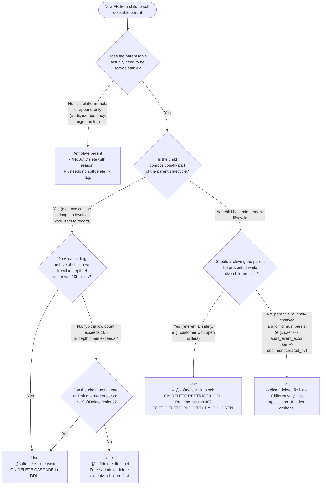

# 12 — Decision Trees

Seven branching diagrams for the choices a porting agent makes most
often. Each tree resolves to a concrete recommendation — not a
"discuss with the team" leaf. The framing for every tree cites the
spec section that justifies the branching.

The trees in this document:

1. [FK annotation: `cascade` / `block` / `hide` / not soft-deletable](#1-which-fk-annotation-should-i-use)
2. [Should this table be soft-deletable?](#2-should-this-table-be-soft-deletable)
3. [Should this route be `@ReadOnly`?](#3-should-this-route-be-readonly)
4. [Should this route be `@Idempotent`?](#4-should-this-route-be-idempotent)
5. [Should this be a system context (`withSystemContext`) op?](#5-should-this-be-a-system-context-operation-withsystemcontext)
6. [Should this column be in the PII map, with what strategy?](#6-should-this-column-be-in-the-pii-map-and-with-what-strategy)
7. [Is this column a tenant column?](#7-is-this-column-a-tenant-column)

All trees draw their branching criteria from `STYNX-SPEC-v0.6.md`,
ADR-001 (soft delete), ADR-002 (perms cache), the invariants in
`04-INVARIANTS-AND-CONTRACTS.md`, and the spec excerpts in
`16-SPEC-EXCERPTS/`.

---

## 1. Which FK annotation should I use?

Every FK to a soft-deletable parent must carry exactly one of
`-- @softdelete_fk: cascade | block | hide`, and the migration
linter rejects any FK lacking the annotation
(`16-SPEC-EXCERPTS/soft-delete-model.md` §14.7;
`STYNX-SPEC-v0.6.md` §14.7). Picking the wrong tag is the most
expensive porting bug — `block` over-protects and surfaces 409s in
user flows; `cascade` under-protects and silently destroys
independent children; `hide` orphans rows that should have been
co-archived. The fourth branch — making the parent
**not soft-deletable at all** via `@NoSoftDelete('reason')` — is
reserved for tables where archive semantics actively conflict with
the table's purpose.



**Notes / edge cases:**

- `cascade` cascades **archive moves**, not hard deletes. A hard
  delete on the parent still falls back to PostgreSQL's literal
  `ON DELETE` action; if you also need RESTRICT-on-hard-delete,
  declare the FK as `ON DELETE RESTRICT` and rely on the runtime to
  cascade soft-delete via the registry walk.
- `hide` rows are **not** auto-co-archived on restore. If the parent
  comes back, hidden orphans remain visibly orphaned until either
  the application heals them or a follow-up restore is issued.
  Document this in the entity's README.
- `cascade` depth and row caps come from `core.config`
  (`maxCascadeDepth=4`, `maxCascadeRows=100`,
  `16-SPEC-EXCERPTS/soft-delete-model.md`). Override per call via
  `SoftDeleteOptions` only when the limit would otherwise force a
  `block` annotation that is semantically wrong.
- A self-referential FK (e.g. `parent_id` on a tree node) almost
  always wants `cascade` with depth override; `block` deadlocks the
  archive on the first descendant.
- FKs **from** `archive.*` tables are forbidden by the model
  (`16-SPEC-EXCERPTS/soft-delete-model.md`: "no FKs on archive
  tables"). The decision tree applies only to live-side FKs.

---

## 2. Should this table be soft-deletable?

I8 in `04-INVARIANTS-AND-CONTRACTS.md` makes soft-delete the default
for every tenant-scoped live table. Opt-out requires
`@NoSoftDelete('reason')` on the entity model **and** a
`-- @no_soft_delete: <reason>` annotation in the migration; the
linter enforces both (`STYNX-SPEC-v0.6.md` §14;
`16-SPEC-EXCERPTS/soft-delete-model.md`). The decision is therefore
not "should I add an archive mirror" but "do I have a documented
reason to skip one."

```mermaid
flowchart TD
  Start([New table being authored]) --> Q1{Does the table<br/>have a tenant_id column<br/>per I5?}
  Q1 -- "No, it is platform-meta in<br/>core.* / audit.* / tenancy.*" --> Q2{Is it append-only by design<br/>(audit log, migration log,<br/>idempotency keys,<br/>system_op events)?}
  Q2 -- "Yes" --> LeafNo1[Not soft-deletable.<br/>@NoSoftDelete('append-only platform table').<br/>Add -- @no_soft_delete annotation.]
  Q2 -- "No, it is mutable platform meta<br/>(tenants, plans, settings,<br/>FK registry rows)" --> Q3{Does removing a row<br/>need recall semantics?}
  Q3 -- "Yes" --> LeafYesCustom[Soft-deletable.<br/>Use data.create_soft_deletable_table.<br/>Even cross-schema; archive mirror<br/>lands in archive.]
  Q3 -- "No: rows are config that is<br/>safely re-creatable from migration" --> LeafNo2[Not soft-deletable.<br/>@NoSoftDelete('config; recreate from migration').]
  Q1 -- "Yes (tenant-scoped)" --> Q4{Is the table itself an<br/>archive mirror, audit log,<br/>or other I8-exempt concern?}
  Q4 -- "Yes" --> LeafNo3[Not soft-deletable.<br/>Archive tables are not themselves archived.]
  Q4 -- "No, it is a domain table" --> Q5{Will users delete rows<br/>via the API surface?}
  Q5 -- "No, rows are immutable<br/>or only ever upserted" --> Q6{Could compliance/<br/>support ever need to<br/>recall a row?}
  Q6 -- "Yes" --> LeafYesDefault[Soft-deletable (default).<br/>Use data.create_soft_deletable_table.]
  Q6 -- "No" --> LeafYesDefault
  Q5 -- "Yes" --> LeafYesDefault
```

**Notes / edge cases:**

- `is_active` is **not** a substitute for soft delete
  (`16-SPEC-EXCERPTS/soft-delete-model.md`: "is_active is NOT soft
  delete"). A table can carry both — `auth.users` and
  `tenancy.tenants` do — but having `is_active` does not absolve a
  table from needing an archive mirror if it is otherwise
  user-deletable.
- High-write tables (telemetry, event streams) often justify
  `@NoSoftDelete('high-volume; archive would dwarf live')`. State
  the volume explicitly in the reason — `stynx doctor` reads
  reasons during audits.
- A table that is "soft-deletable in spirit" but not yet adopted
  (early port phase) should still get the helper-generated mirror;
  do not add `@NoSoftDelete` as a stalling tactic. The linter will
  later flag undeclared FKs to it and force a clean choice.
- Live tables of soft-deletable entities **must not** carry
  `deleted_at`/`deleted_by` columns (I8;
  `16-SPEC-EXCERPTS/tenancy-model.md`). If the foreign codebase has
  them, drop the columns in the same migration that introduces the
  archive mirror.
- Cross-schema mirrors are fine (`sample.x` →
  `archive.sample_x`) but the linter detects naming collisions
  across schemas. If a name collides, prefix the schema in the
  source schema name to disambiguate.

---

## 3. Should this route be `@ReadOnly`?

I7 makes `@ReadOnly()` the way to opt a route into the
`stynx_reader` role with `app.role='reader'`,
`Database.tx({ role:'reader', readonly:true })`
(`04-INVARIANTS-AND-CONTRACTS.md` I7). The decision is mostly
mechanical — every GET that does not write — but the edge cases
(`last_seen_at` updates, materialized-view refresh,
read-through caches) trip every port.

```mermaid
flowchart TD
  Start([Route being authored]) --> Q1{Is the HTTP verb<br/>GET or HEAD?}
  Q1 -- "No (POST/PUT/PATCH/DELETE)" --> LeafNoMutation[Do NOT add @ReadOnly.<br/>Mutations require the writable role.]
  Q1 -- "Yes" --> Q2{Does the handler write<br/>any row, anywhere?}
  Q2 -- "Yes — true mutation<br/>disguised as GET" --> LeafFix[STOP. Convert to POST<br/>or move the side-effect out.<br/>GET that writes violates HTTP<br/>semantics and breaks caching.]
  Q2 -- "Yes — incidental:<br/>last_seen_at,<br/>view_counter increment,<br/>cache write-back" --> Q2a{Can the side-effect<br/>be made async via<br/>fire-and-forget queue<br/>or a separate POST?}
  Q2a -- "Yes" --> LeafReadOnly[Use @ReadOnly.<br/>Move side-effect to async path<br/>or to a dedicated POST.]
  Q2a -- "No, side-effect must be<br/>inline and synchronous" --> LeafNoReadOnly[Do NOT add @ReadOnly.<br/>Document why in the<br/>controller comment.]
  Q2 -- "No" --> Q3{Does the handler call<br/>any other service that<br/>writes (audit-only writes<br/>excluded)?}
  Q3 -- "Yes" --> LeafNoReadOnly
  Q3 -- "No" --> Q4{Is the route a report,<br/>list, search, count,<br/>aggregate, or export?}
  Q4 -- "Yes" --> LeafReadOnly
  Q4 -- "No, single-row read<br/>(GET /:id)" --> LeafReadOnly
```

**Notes / edge cases:**

- Audit rows written by the DB trigger do **not** count as a "write"
  for this purpose: `stynx_reader` has SELECT-only grants, but the
  trigger fires under the connection's role only when an INSERT/
  UPDATE/DELETE occurs on the audited table. A pure GET on a
  reader-role connection produces zero audit rows.
- If the route hits `withReplica`, `@ReadOnly` is still correct —
  the role and the replica selection are orthogonal; the replica
  call goes through `stynx_reader` by default.
- Routes that **conditionally** mutate (e.g. "create-on-read" idiom)
  must not be `@ReadOnly`. Either split into a `GET /:id` plus a
  `POST /` create, or accept the writable role and document the
  side-effect.
- Health endpoints that hit the DB should use
  `Database.withReplica` and `@ReadOnly`; pair with `@Public()` so
  they bypass auth (I4;
  `16-SPEC-EXCERPTS/permission-model.md`).
- A route that is `@ReadOnly` and triggers `ReadOnlyViolationError`
  in tests is the canonical signal that a hidden write slipped in;
  treat the error as a green-build blocker, not a flaky test.

---

## 4. Should this route be `@Idempotent`?

`STYNX-SPEC-v0.6.md` §22 defines `@Idempotent('Idempotency-Key')`
with Stripe-compatible semantics: 24h default TTL, Redis cache
backed by `core.idempotency_keys`, in-flight requests block on a
Redis lock. Idempotency is mandatory for any non-GET route where
a client retry could cause duplicate side-effects (typically all
POSTs that create resources or charge money). GETs are naturally
idempotent at the HTTP-method level and need no annotation.

```mermaid
flowchart TD
  Start([Route being authored]) --> Q1{Is the HTTP verb<br/>POST, PUT, PATCH, or DELETE?}
  Q1 -- "GET / HEAD / OPTIONS" --> LeafGet[Do NOT add @Idempotent.<br/>HTTP method is already idempotent.]
  Q1 -- "DELETE" --> Q2{Does DELETE produce<br/>a side-effect on retry<br/>(e.g. audits a 404,<br/>charges a fee, sends notify)?}
  Q2 -- "No, retry is a clean 404" --> LeafSkip[Do NOT add @Idempotent.<br/>DELETE is naturally idempotent here.]
  Q2 -- "Yes" --> LeafYesD[Use @Idempotent('Idempotency-Key').<br/>24h TTL adequate.]
  Q1 -- "PUT" --> Q3{Is PUT a true replace<br/>(client provides full<br/>resource, server stores)?}
  Q3 -- "Yes" --> LeafSkipPut[Optional. PUT is HTTP-idempotent.<br/>Add @Idempotent only if<br/>side-effects beyond the row<br/>itself fire on retry.]
  Q3 -- "No, PUT is really a<br/>create-or-update with<br/>side-effects" --> LeafYesC[Use @Idempotent('Idempotency-Key').]
  Q1 -- "POST / PATCH" --> Q4{Does the handler create<br/>a new resource or<br/>charge / send / dispatch<br/>an external action?}
  Q4 -- "Yes" --> Q5{Could a client retry<br/>(network blip, 5xx,<br/>timeout) cause a<br/>duplicate?}
  Q5 -- "Yes" --> LeafYesA[Use @Idempotent('Idempotency-Key').<br/>Increase TTL beyond 24h<br/>only for very long-lived flows.]
  Q5 -- "No, action is naturally<br/>deduped (e.g. unique<br/>constraint on (tenant_id, slug))" --> LeafSkipUnique[Optional. The unique<br/>constraint dedupes;<br/>still recommended for<br/>cleaner 409 vs 200 responses.]
  Q4 -- "No, POST is a search/<br/>action that is read-only" --> LeafSkipSearch[Do NOT add @Idempotent.<br/>Consider switching to GET.]
```

**Notes / edge cases:**

- The header name **must** be `Idempotency-Key` (Stripe convention,
  spec §22). Custom header names break the test-pack matchers.
- Mutations that update a single tenant-scoped row by id (e.g.
  `PATCH /things/:id`) are mostly self-deduping but still benefit
  from `@Idempotent` because retries can hit a different replica
  while the first transaction is in-flight; the Redis lock
  serializes them.
- Bulk-import endpoints should set TTLs longer than 24h if the
  client may retry hours later from a queue; document the override.
- `@Idempotent` does **not** replace `@RateLimit`. They compose:
  rate-limit caps the rate of distinct keys; idempotency caps the
  cost of a retry storm on the same key.
- Routes annotated `@Idempotent` get a per-route durable test
  (`STYNX-SPEC-v0.6.md` §17 testing matrix entry 7); a missing
  matcher is a CI failure, not a warning.

---

## 5. Should this be a system context operation (`withSystemContext`)?

I2 forbids any DB query outside a request-scoped `TenantContext`
unless explicitly opted in via `withSystemContext(reason, fn)`,
and the `reason` is recorded in `audit.system_op`
(`04-INVARIANTS-AND-CONTRACTS.md` I2;
`16-SPEC-EXCERPTS/tenancy-model.md` §4.6). The decision is binary:
if a piece of code runs outside a request and touches the DB, it
must be wrapped — but wrapping work that _is_ in a request is a
silent privilege escalation that bypasses RLS for no reason.

```mermaid
flowchart TD
  Start([Code path needs DB access]) --> Q1{Is the code running<br/>inside an HTTP / Lambda<br/>request handler with<br/>nestjs-cls TenantContext?}
  Q1 -- "Yes (controller, guard,<br/>interceptor, service<br/>called from controller)" --> Q2{Does it need to read<br/>or write across<br/>multiple tenants in<br/>one transaction?}
  Q2 -- "No" --> LeafTenant[Use Database.tx(...).<br/>Do NOT use withSystemContext;<br/>that would bypass RLS<br/>without justification.]
  Q2 -- "Yes (platform admin route,<br/>billing roll-up, fan-out)" --> Q3{Is the controller<br/>method already decorated<br/>@System()?}
  Q3 -- "Yes" --> LeafSystemRoute[Use Database.tx with the<br/>system context already<br/>installed by @System().<br/>No explicit withSystemContext<br/>call needed.]
  Q3 -- "No" --> LeafAddSystem[STOP. Add @System() to the<br/>controller method first<br/>(I4 + spec §4.6); then rely on<br/>the auto-installed context.]
  Q1 -- "No (cron, queue worker,<br/>boot seed, CLI command,<br/>DB-trigger callback,<br/>health probe writing)" --> Q4{Does it need DB at all?<br/>Could it use a config<br/>file or env?}
  Q4 -- "No" --> LeafNoDB[Skip DB entirely.]
  Q4 -- "Yes" --> Q5{Is it pure read for<br/>a probe?}
  Q5 -- "Yes" --> LeafReadProbe[Use Database.withReplica<br/>inside withSystemContext('healthz').]
  Q5 -- "No, it writes" --> LeafSysCtx[Use<br/>withSystemContext('cron-name', () => ...).<br/>Reason MUST be a stable<br/>identifier; it lands in audit.system_op.]
```

**Notes / edge cases:**

- The `reason` argument is a **stable identifier**, not a free-form
  message. It lands in `audit.system_op` and is queried by
  compliance reports. Use names like `daily-billing-rollup`,
  `tenant-purge`, `lgpd-erasure-pipeline`.
- `withSystemContext` runs as `stynx_owner` (BYPASSRLS); pair it
  with explicit `WHERE tenant_id = ...` predicates if the operation
  is logically scoped to a single tenant. RLS is no longer doing
  that work for you.
- Calling `withSystemContext` from inside a request handler is an
  anti-pattern that masks a missing `@System()` decorator. The
  linter (FIND-008-style) treats nested system contexts as a
  finding.
- Long-running system jobs should partition work into many
  `withSystemContext` invocations per tenant rather than one giant
  cross-tenant transaction; the audit blast-radius and lock
  contention are proportional.
- Boot-time seeding (e.g. installing default roles) is the
  canonical legitimate use; the migration-runner already wraps it.
  Application code rarely needs it outside cron and queue workers.

---

## 6. Should this column be in the PII map, and with what strategy?

`STYNX-SPEC-v0.6.md` §21.2 defines the PII map and its four erasure
strategies (`nullify`, `hash_with_salt`, `tombstone_row`,
`delete_row`). The choice depends on (a) whether the column is
identifying, (b) whether downstream rows depend on the value being
present, and (c) whether the row itself is meaningful without the
PII column. The LGPD pipeline processes both live and archive in
one call, so the strategy must work for both.

```mermaid
flowchart TD
  Start([Column being declared]) --> Q1{Is the column itself PII<br/>or a direct subject link?}
  Q1 -- "No (technical id,<br/>numeric metric, enum)" --> LeafSkip[Skip. Not in PII map.]
  Q1 -- "Yes" --> Q2{Is the column a foreign-key<br/>or implicit link to the<br/>data subject<br/>(owner_user_id, created_by)?}
  Q2 -- "Yes" --> LeafSubjectLink[category: subject_link.<br/>No erasure strategy on the column;<br/>the row's fate is decided<br/>at the row level by the<br/>parent's strategy.]
  Q2 -- "No, column carries<br/>direct PII (cpf, email,<br/>phone, full name,<br/>street_address)" --> Q3{Is the column required<br/>by a NOT NULL constraint?}
  Q3 -- "Yes" --> Q4{Is the value cryptographically<br/>recoverable / verifiable<br/>(needed for join keys,<br/>uniqueness checks)?}
  Q4 -- "Yes (e.g. hashed CPF used<br/>for dedupe across tenants)" --> LeafHash[erasure: hash_with_salt.<br/>Stable hash; preserves uniqueness,<br/>destroys plaintext recovery.]
  Q4 -- "No" --> Q5{Is the row itself useful<br/>after the column is wiped?}
  Q5 -- "Yes (work_item retains<br/>business meaning without<br/>customer email)" --> LeafTombstone[erasure: tombstone_row.<br/>Replace PII with sentinel<br/>literal (e.g. '[ERASED]');<br/>row stays for referential<br/>integrity.]
  Q5 -- "No, the row is the subject<br/>itself (auth.users row<br/>with no other purpose)" --> LeafDelete[erasure: delete_row.<br/>Whole row removed from<br/>both live and archive.]
  Q3 -- "No (column is nullable)" --> Q6{Does any downstream<br/>system depend on the<br/>column being present?}
  Q6 -- "Yes" --> LeafTombstone
  Q6 -- "No" --> LeafNullify[erasure: nullify.<br/>Set column to NULL in<br/>both live and archive.]
  Q1 -- "Incidental PII (filename,<br/>free-text comment that<br/>may contain PII)" --> Q7{Can the field be safely<br/>cleared without breaking<br/>the row?}
  Q7 -- "Yes" --> LeafIncidental[category: incidental_pii.<br/>erasure: nullify.]
  Q7 -- "No, must be present" --> LeafIncidentalT[category: incidental_pii.<br/>erasure: tombstone_row.]
```

**Notes / edge cases:**

- Strategy choice is per-column, but `delete_row` and
  `tombstone_row` operate at the row level — declaring two
  competing strategies on different columns of the same table is a
  PII-map conflict and the privacy linter rejects it.
- `hash_with_salt` requires the salt to be provisioned before the
  pipeline runs; the salt rotates with the tenant lifecycle and is
  part of the privacy module's runtime config.
- `delete_row` on a parent with `cascade` FK children erases the
  cascaded archive descendants too — verify the descendants' PII
  map agrees, or the pipeline raises a strategy conflict.
- Audit log columns are **never** in the PII map directly. LGPD
  erasure of audit data is governed by the 5-year retention rule
  on `lgpd_erasure`-tagged partitions
  (`16-SPEC-EXCERPTS/audit-model.md` §9.4); do not try to nullify
  `audit.log.before` / `after` jsonb columns piecemeal.
- The metric `lgpd_erasure_total{table, strategy}` is incremented
  on every erasure write; a strategy of `tombstone_row` produces
  one increment per column wiped within the row.

---

## 7. Is this column a tenant column?

I5 requires every tenant-scoped table to carry a single
`tenant_id uuid NOT NULL REFERENCES tenancy.tenants(id)` column,
plus an RLS policy keyed on
`current_setting('app.tenant_id', true)::uuid`
(`04-INVARIANTS-AND-CONTRACTS.md` I5;
`16-SPEC-EXCERPTS/tenancy-model.md` §4.4). The decision tree
distinguishes the canonical tenant column from columns that _look_
tenant-shaped (legacy `org_id`, parent FKs to a tenant-scoped
parent, platform-meta tables that genuinely have no tenant).

```mermaid
flowchart TD
  Start([Column being declared]) --> Q1{Is the column literally<br/>named tenant_id of type<br/>uuid NOT NULL?}
  Q1 -- "Yes" --> Q2{Does it REFERENCES<br/>tenancy.tenants(id)?}
  Q2 -- "Yes" --> LeafCanonical[YES — canonical tenant column.<br/>RLS policy must reference it<br/>via current_setting('app.tenant_id').]
  Q2 -- "No" --> LeafFixFK[YES — but ADD the FK<br/>REFERENCES tenancy.tenants(id).<br/>Linter LINT003-ish requires it.]
  Q1 -- "No, it is named org_id /<br/>account_id / customer_id /<br/>workspace_id" --> Q3{Is the table tenant-scoped<br/>per the tenancy model?}
  Q3 -- "Yes" --> LeafRename[YES, after rename.<br/>Rename to tenant_id in a single<br/>migration; add FK + RLS policy<br/>(see tenancy-model.md adoption hint).]
  Q3 -- "No" --> LeafBusinessFK[NOT a tenant column.<br/>It is a domain FK; keep its name.<br/>RLS does not apply to it.]
  Q1 -- "No, it is a parent FK<br/>(record_id, document_id) to<br/>another tenant-scoped table" --> Q4{Does the row inherit<br/>its tenant from the parent?}
  Q4 -- "Yes" --> Q5{Is the table itself<br/>tenant-scoped?}
  Q5 -- "Yes" --> LeafChild[NOT a tenant column.<br/>Still add tenant_id alongside the<br/>parent FK — denormalized for RLS<br/>(I5 requires the column on<br/>every tenant-scoped row).<br/>Enforce equality via trigger or check.]
  Q5 -- "No" --> LeafCheck[Re-evaluate.<br/>If the parent is tenant-scoped<br/>but this child is not, this is<br/>almost certainly a bug.<br/>Add tenant_id and RLS.]
  Q4 -- "No" --> LeafBusinessFK
  Q1 -- "No, this is a platform-meta<br/>table column<br/>(audit.log.tenant_id,<br/>core.idempotency_keys.tenant_id)" --> Q6{Is it nullable?}
  Q6 -- "Yes (audit.log.tenant_id<br/>can be NULL for system_op rows)" --> LeafPlatformNullable[Tenant column, nullable variant.<br/>Schema lives outside RLS<br/>(audit has no RLS;<br/>16-SPEC-EXCERPTS/tenancy-model.md §4.3).<br/>Read paths gate on platform role.]
  Q6 -- "No" --> LeafPlatformStrict[Tenant column.<br/>Even though the table is in<br/>core.* / tenancy.*, the row is<br/>tenant-scoped (e.g. core.idempotency_keys).<br/>Add RLS policy as for live tables.]
```

**Notes / edge cases:**

- A child table that inherits its tenant from a parent FK
  **still carries `tenant_id` denormalized** — RLS evaluates each
  row in isolation and cannot follow FKs. The classic bug is to
  trust the parent's RLS and omit the column on the child; the
  result is either a policy that always fails or RLS effectively
  bypassed. Use the helper or hand-write both the column and the
  policy.
- `tenancy.tenants` itself is **not** tenant-scoped (the tenant
  _is_ the row). Its RLS policy keys on `id = app.tenant_id`, not
  `tenant_id = app.tenant_id`.
- `auth.users` is tenant-scoped via its membership rows
  (`auth.memberships.tenant_id`); the `users` row carries no
  `tenant_id` because users can be members of multiple tenants
  (subject to the §4 single-tier model — verify against the
  current spec when in doubt).
- `WHERE tenant_id = $1` predicates in application code are
  **forbidden** once RLS is enabled (I5 detection table;
  `16-SPEC-EXCERPTS/tenancy-model.md` adoption hint step 3) — they
  signal that the migration is incomplete or the developer does
  not trust RLS.
- Migrating a column from `org_id` to `tenant_id` is a single
  rename + FK add + policy create, all in one transaction. Splitting
  the rename across migrations leaves the policy referencing a
  column that does not exist for one deploy window — do it
  atomically.

---

## Cross-tree composition

The seven trees are independent inputs to a single declaration. A
typical new tenant-scoped, soft-deletable, write-mutation route ends
up annotated:

```typescript
@Post()
@Permission('document:write:*')
@RateLimit({ bucket: 'tenant', scope: 'documents.write' })
@Audit({ entity: 'document', op: 'create' })
@Idempotent('Idempotency-Key')                   // tree 4 -> yes
create(@Body() dto: CreateDocDto) { /* writable role; tree 3 -> no */ }
```

Backed by a table whose migration ran:

```sql
SELECT data.create_soft_deletable_table($$       -- tree 2 -> yes
  CREATE TABLE sample.document (
    id uuid PRIMARY KEY DEFAULT gen_random_uuid(),
    tenant_id uuid NOT NULL                      -- tree 7 -> yes
      REFERENCES tenancy.tenants(id),
    record_id uuid NOT NULL                      -- tree 1 input
      REFERENCES sample.record(id),
    -- @softdelete_fk: cascade                   -- tree 1 -> cascade
    customer_email text,                         -- tree 6 -> nullify
    cpf text NOT NULL,                           -- tree 6 -> hash_with_salt
    ...
  );
$$);
```

If any one of the trees was skipped — a missing FK annotation, a
bare `tenant_id` without a policy, a column missing from the PII
map, an unguarded route — the migration linter, `stynx doctor`, or
CI's invariant matcher will reject the change before merge.

The trees do not compose with each other's _answers_ — they compose
with the rules in `04-INVARIANTS-AND-CONTRACTS.md`. Use this file
as a worksheet at authoring time; use the invariants doc as the
ground-truth verifier.

---

## Where each tree's logic lives in code

| Tree                   | Spec anchor                         | Runtime / lint enforcement                                                                                             |
| ---------------------- | ----------------------------------- | ---------------------------------------------------------------------------------------------------------------------- |
| 1. FK annotation       | `STYNX-SPEC-v0.6.md` §14.7; ADR-001 | `tools/migration-linter` LINT00x (FK rules); `core.softdelete_fk_registry`; runtime cascade walker in `@stynx-nyx/data`    |
| 2. Soft-deletable      | `STYNX-SPEC-v0.6.md` §14; I8        | `data.create_soft_deletable_table`; migration linter (mirror presence, `deleted_at` ban); `@NoSoftDelete` reason check |
| 3. `@ReadOnly`         | I7; permission-model.md §6.2        | `Database.tx({ role:'reader', readonly:true })`; `ensureWritableRole()` raises `ReadOnlyViolationError`                |
| 4. `@Idempotent`       | `STYNX-SPEC-v0.6.md` §22            | `core.idempotency_keys`; Redis lock + cache; per-route durable test in `@stynx-nyx/testing`                                |
| 5. `withSystemContext` | I2; tenancy-model.md §4.6           | `TenantContextMissingError` at `tx()` entry; `audit.system_op` records reason                                          |
| 6. PII map             | `STYNX-SPEC-v0.6.md` §21.2          | `@stynx-nyx/privacy` PII map loader; `lgpd_erasure_total{table,strategy}` metric; ROPA generator (`stynx privacy ropa`)    |
| 7. Tenant column       | I5; tenancy-model.md §4.4           | Migration linter LINT001–009; runtime RLS at the DB layer                                                              |

Use this table as the lookup when a tree's recommendation surfaces
an error in CI: every leaf has a named enforcement mechanism, and
finding the failing one tells you which tree to revisit.
