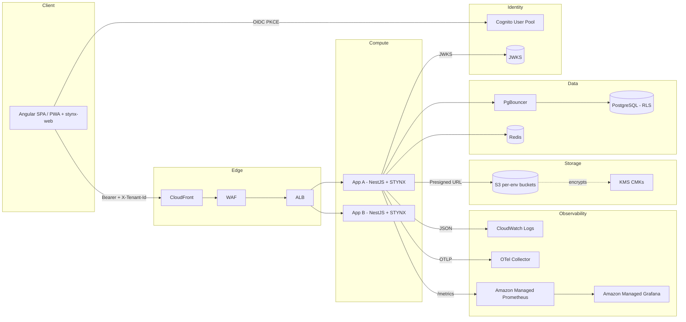
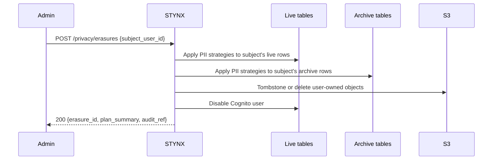

# STYNX — Platform Foundation Specification

&gt; Shared foundation for in‑house NestJS applications and their Angular clients: identity, multi‑tenancy, storage, audit, soft‑delete via archive, observability, privacy, and the surrounding rails.

**Status:** Draft v0.6 · Specification only (no implementation) · **All open questions resolved; ready for v1.0 implementation sign‑off**
**Previous:** v0.5
**Audience:** Platform engineers, application engineers consuming STYNX, SRE
**Scope:** A versioned, NPM‑published platform library family (NestJS backend + Angular frontend) + a CLI + a set of operational contracts that every in‑house app inherits.

### Changelog v0.5 → v0.6

Final resolution of §27 Open Questions:

- **Archive size metric sampling:** daily, per table (§11, §14.8).
- **`hide`‑FK sidecar column (`archived_links jsonb`):** not added in v1.0. Admin trash views show only the deleted row itself; historical FK topology is reconstructable from audit if needed (§14.7, §14.10).
- **Cascading restore permission:** reuses per‑child `:restore:*`; no separate `:restore_cascade:*`. Missing permission on any child aborts with 403 listing the denied tables (§14.6).
- **`stynx doctor` `is_active` / soft‑delete disambiguation:** emits an informational note when a soft‑deletable table also carries `is_active`, pointing to the semantic distinction (§14.1, §16.3).
- **New metric** `lgpd_erasure_total&#123;table,strategy&#125;` added to the baseline metrics set (§11).
- **LGPD‑tagged audit retention:** 5 years hot (vs 90 days general), via partition‑selection rule in the detach job (§9.2).

No structural changes to the architecture, schema layout, or invariants. §27 closes with zero open questions.

---

## 0. How to read this document

Sections marked **[SPEC]** are normative — they define contracts that STYNX and its consumers must honor. Sections marked **[OPINION]** are opinionated design choices where alternatives exist; rationale is given. Sections marked **[v1.1+]** are explicitly deferred from v1.0.

Where this spec references AWS primitives, the target is one AWS account per environment (`dev`, `stage`, `prod`) with cross‑account IAM roles for CI. Region default is `sa‑east‑1` (São Paulo); `us‑east‑1` is used only for globally‑scoped services (IAM, Route 53, CloudFront, ACM global). All tenants share the same region per environment, fixed at platform setup.

---

## 1. Goals, Non‑Goals, and Invariants

### 1.1 Goals [SPEC]

1. **One foundation, many apps.** Every in‑house service starts from `@stynx-nyx/core` and inherits identity, tenancy, audit, soft‑delete (via archive), logging, storage, health, rate‑limiting, privacy, idempotency, i18n, and testing rails with zero bespoke code for those concerns.
2. **One foundation, both ends.** Angular clients start from `@stynx-web/*` and inherit auth, tenancy switching, document upload, session UI, trash management, and i18n with the same DRY guarantee.
3. **Security by default.** RLS is always on. JWT verification is never bypassable at the framework level. Logs are redacted by default. Presigned URLs always carry a tenant claim check.
4. **Multi‑tenant from zero.** Tenancy is a cross‑cutting invariant enforced at HTTP, service, database, and storage layers.
5. **Thin controllers, fat services, push down to the database.** Controllers are DTO binders. Business logic lives in services. Data constraints live in the database (RLS, triggers, check constraints, generated columns, domain types).
6. **Recoverable by default.** User‑facing deletes are soft (moved to archive). Hard delete is exceptional and explicitly authorized.
7. **DRY migration path.** Existing services must be adoptable incrementally — codemods + checklist, not rewrite.
8. **Observable and governable.** Every request is end‑to‑end traceable. Every sensitive mutation is auditable. Every tenant's usage is attributable.
9. **LGPD‑ready.** Data export and erasure pipelines are first‑class; both live and archive are processed.

### 1.2 Non‑goals [SPEC]

- **No multi‑cloud.** AWS‑only.
- **No native mobile shells.** Web/Angular (including PWAs) only.
- **No product‑specific domain logic.** STYNX has no opinion about consumer domains.
- **No event bus, no background jobs, no webhooks in v1.0.** Deferred (§24).
- **No ABAC.** Pure RBAC of shape `resource:action:scope`.
- **No tenant self‑service signup, no M2M API keys, no relationship authz.**
- **No time‑based archive purge.** Archive is permanent by design.

### 1.3 Invariants [SPEC]

- **I1 — No raw DB connection.** All DB access goes through STYNX's connection manager, which sets `app.tenant_id`, `app.actor_id`, `app.request_id`, `app.session_id` GUCs on every transaction.
- **I2 — No query outside a request context.** Background work obtains an explicit `TenantContext` via `withSystemContext(reason, fn)`.
- **I3 — No direct S3 client.** All object operations go through `@stynx-nyx/storage`.
- **I4 — Every HTTP route has a permission.** Routes without `@Permission(...)`, `@Public()`, or `@System()` fail CI.
- **I5 — Every tenant‑scoped table has `tenant_id uuid NOT NULL` and an RLS policy.**
- **I6 — Every mutation is audited** unless annotated `@NoAudit('reason')`.
- **I7 — Read‑only clients use the RO role.** `@ReadOnly()` routes connect via `stynx_reader`.
- **I8 — Every tenant‑scoped table is soft‑deletable** unless annotated `@NoSoftDelete('reason')`. Soft‑deletable tables MUST have a corresponding `archive.&#123;schema&#125;_&#123;table&#125;` mirror declared in the same migration. Live tables of soft‑deletable entities do **not** carry `deleted_at`/`deleted_by` columns — deletion metadata lives in the archive mirror only.

---

## 2. High‑Level Architecture



---

## 3. Monorepo Layout and Package Topology [SPEC]

STYNX is a **single pnpm + Turborepo monorepo**, published under the `@stynx` and `@stynx-web` scopes to **GitHub Packages**.

```
stynx/
├── packages/                       # Backend (Node/NestJS)
│   ├── core/
│   ├── auth/
│   ├── tenancy/
│   ├── data/                       # DB, Drizzle, tx, RO mode, soft-delete (archive move), migration runner
│   ├── storage/
│   ├── audit/
│   ├── logging/
│   ├── health/
│   ├── sessions/
│   ├── ratelimit/
│   ├── idempotency/
│   ├── privacy/                    # LGPD on live + archive
│   ├── i18n/
│   ├── testing/
│   ├── contracts/
│   └── cli/
│
├── packages-web/                   # Frontend (Angular / TS)
│   ├── sdk/                        # Framework-agnostic, generated from OpenAPI
│   ├── angular/
│   ├── angular-auth/
│   ├── angular-tenancy/
│   ├── angular-storage/
│   ├── angular-sessions/
│   ├── angular-profile/
│   ├── angular-trash/              # Generic soft-delete/restore UI
│   ├── angular-i18n/
│   └── angular-ui/
│
├── apps/
│   ├── reference-api/
│   └── reference-web/
│
├── tools/
│   ├── eslint-config/
│   ├── tsconfig/
│   └── migration-linter/           # Lints I5, I6, I8 (including archive mirror)
│
├── .changeset/
├── turbo.json
├── pnpm-workspace.yaml
└── package.json
```

Publication via Changesets to GitHub Packages, single repo. Exports barreled. NestJS / RxJS / Angular as peers.

---

## 4. Multi‑Tenancy Model

### 4.1 Tenancy model [SPEC]

**Pool + RLS, single tier, no escalation.** One DB per env, one Cognito pool per env, one S3 bucket per env. All tenants share. Per‑tenant S3 prefix. Region fixed at install.

### 4.2 Tenant identification [SPEC]

Resolution order: `X-Tenant-Id` header → bearer `tenant_id` claim → subdomain. Resolved tenant placed in request‑scoped `TenantContext` via nestjs‑cls. Reading `TenantContext.tenantId` outside a request throws unless inside `withSystemContext(...)`.

### 4.3 Database schema layout [SPEC]

STYNX owns six PostgreSQL schemas:

| Schema    | Purpose                                                                                                             | RLS                        |
| --------- | ------------------------------------------------------------------------------------------------------------------- | -------------------------- |
| `core`    | Platform meta: configuration, rate‑limit overrides, idempotency keys, schema migration log, soft‑delete FK registry | Mixed                      |
| `tenancy` | Tenant lifecycle: tenants, plans, settings                                                                          | RLS on tenant‑scoped views |
| `auth`    | Identity/authz: users, roles, perms, groups, memberships, sessions, invitations                                     | RLS                        |
| `audit`   | Append‑only audit log, partitioned monthly                                                                          | No RLS; platform role only |
| `storage` | Document registry                                                                                                   | RLS                        |
| `archive` | Mirrored tables of every soft‑deletable live table; holds soft‑deleted rows permanently                             | RLS                        |

### 4.4 RLS enforcement [SPEC]

Standard tenant‑scoped live table shape:

```sql
CREATE TABLE sample.example_entity (
  id           uuid PRIMARY KEY DEFAULT gen_random_uuid(),
  tenant_id    uuid NOT NULL REFERENCES tenancy.tenants(id),
  -- domain columns ...
  created_at   timestamptz NOT NULL DEFAULT now(),
  created_by   uuid NOT NULL,
  updated_at   timestamptz NOT NULL DEFAULT now(),
  updated_by   uuid NOT NULL
);
ALTER TABLE sample.example_entity ENABLE ROW LEVEL SECURITY;
ALTER TABLE sample.example_entity FORCE ROW LEVEL SECURITY;

CREATE POLICY tenant_isolation ON sample.example_entity
  FOR ALL
  USING      (tenant_id = current_setting('app.tenant_id', true)::uuid)
  WITH CHECK (tenant_id = current_setting('app.tenant_id', true)::uuid);
```

Note: live tables of soft‑deletable entities do **not** carry `deleted_at`/`deleted_by`. The archive mirror (§14) carries that metadata. See §14.2 for the mirror's shape.

**Three database roles:**

| Role           | RLS            | Privileges                                 | Used by                              |
| -------------- | -------------- | ------------------------------------------ | ------------------------------------ |
| `stynx_owner`  | BYPASSRLS      | DDL                                        | Migrations; `withSystemContext(...)` |
| `stynx_app`    | Subject to RLS | DML on live + archive; SELECT on `audit.*` | Default app connections              |
| `stynx_reader` | Subject to RLS | SELECT on live + archive                   | Read‑only clients                    |

**GUC plumbing.** First statement of every transaction:

```sql
SET LOCAL app.tenant_id  = '...';
SET LOCAL app.actor_id   = '...';
SET LOCAL app.request_id = '...';
SET LOCAL app.session_id = '...';
SET LOCAL app.role       = 'app' | 'reader' | 'owner';
```

Additional GUCs used by `@stynx-nyx/data` during archive moves (see §9.3):

```sql
SET LOCAL app.archive_move = 'in_progress';    -- suppresses archive-side audit duplication
SET LOCAL app.archive_reason = 'soft_delete';  -- or 'restore'
```

### 4.5 Tenant lifecycle [SPEC]

States: `provisioning → active → suspended → archived → purged`. Suspend ANDs RLS with `is_active`. Archive exports + blocks access. Purge is LGPD hard delete across both live and archive. Platform‑ops only in v1.0.

### 4.6 Cross‑tenant operations [SPEC]

Forbidden by default. Two escape hatches (audited): `@System()` controller methods; `withSystemContext(reason, fn)`. Impersonation disabled by default.

---

## 5. Authentication [SPEC]

### 5.1 Cognito as IdP, STYNX as AuthZ brain [OPINION]

_Cognito strictly as IdP; tenant membership, roles, and permissions in STYNX DB. Source: AWS SaaS Factory Cognito reference patterns._

### 5.2 Token flow

OIDC Auth Code + PKCE against Cognito → STYNX `POST /sessions` exchanges the Cognito access token for a STYNX bearer (10 min) + refresh (24h rotating). SAML federation stub wired into CI.

### 5.3 Session token shape [SPEC]

**Bearer primary.** STYNX bearer JWT (10 min) signed with STYNX‑owned RSA keypair (quarterly rotation, JWKS at `/.well-known/jwks.json`). Claims: `iss, sub, sid, tenant_id, perms_hash, amr, exp, iat, jti`.

**Refresh:** opaque, 24h sliding, rotated on every use, reuse detection kills the entire session family.

**Cookie mode:** optional first‑party web; `sid` httpOnly+Secure+SameSite=Lax, CSRF double‑submit.

### 5.4 Session record

Redis (hot) + `auth.sessions` (durable, partitioned monthly). Fields per v0.3.

### 5.5 Tenant switching

Session rotation — old session revoked, new session minted bound to target tenant.

---

## 6. Authorization [SPEC]

### 6.1 Model — `resource:action:scope` RBAC

Permission keys always `resource:action:scope`. Examples: `document:read:*`, `document:read:own`, `document:write:*`, `document:delete:*` (soft), `document:hard_delete:*`, `document:restore:*`, `document:read_trash:*`.

Default tenant roles seeded on tenant creation: `owner`, `admin`, `member`, `viewer`. Platform roles: `platform:support`, `platform:billing`, `platform:ops`. Group hierarchy depth capped at 8.

### 6.2 Decorators and guards [SPEC]

```typescript
@Controller('documents')
export class DocumentsController {
  @Get(':id')
  @Permission('document:read:*')
  getOne(@Param('id') id: string) { ... }

  @Post()
  @Permission('document:write:*')
  @RateLimit({ bucket: 'tenant', scope: 'documents.write' })
  @Audit({ entity: 'document', op: 'create' })
  @Idempotent('Idempotency-Key')
  create(@Body() dto: CreateDocDto) { ... }

  @Delete(':id')                              // soft delete (move to archive)
  @Permission('document:delete:*')
  remove(@Param('id') id: string) { ... }

  @Delete(':id')                              // hard delete via ?hard=true query param
  @Permission('document:hard_delete:*')
  hardRemove(@Param('id') id: string, @Query('hard') h: 'true') { ... }

  @Post(':id/restore')
  @Permission('document:restore:*')
  restore(@Param('id') id: string) { ... }

  @Get('_trash')
  @Permission('document:read_trash:*')
  listTrash() { ... }

  @Get('reports/usage')
  @Permission('document:read:*')
  @ReadOnly()
  usageReport() { ... }
}
```

### 6.3 Effective permission resolution [SPEC]

Resolved once at session creation. Hashed into `perms_hash`. Cached in Redis, invalidated via pub/sub on role/permission mutation. O(1) hash‑set lookups; wildcards expanded at cache build time.

---

## 7. Identity &amp; Authorization Data Model [SPEC]

Schema `auth` — no `deleted_at`/`deleted_by` on live tables (soft‑deleted rows live in `archive.auth_*`):

```
auth.users (
  id uuid PK,
  cognito_sub text UNIQUE NOT NULL,
  email citext NOT NULL,
  email_verified boolean NOT NULL DEFAULT false,
  locale text NOT NULL DEFAULT 'pt-BR',
  is_active boolean NOT NULL DEFAULT true,
  created_at, updated_at
)

auth.memberships (
  id uuid PK,
  tenant_id uuid NOT NULL REFERENCES tenancy.tenants(id),
  user_id uuid NOT NULL REFERENCES auth.users(id),
  status text NOT NULL,
  invited_by uuid, invited_at, joined_at,
  UNIQUE(tenant_id, user_id)                -- plain constraint; archive rows live elsewhere
)

auth.roles (
  id uuid PK,
  tenant_id uuid NULL REFERENCES tenancy.tenants(id),
  key text NOT NULL,
  name text NOT NULL,
  is_system boolean NOT NULL DEFAULT false,
  description text,
  UNIQUE(tenant_id, key)
)

auth.perms (
  key text PK,
  resource text NOT NULL,
  action text NOT NULL,
  scope text NOT NULL DEFAULT '*',
  description text
)

auth.role_perms        (role_id, perm_key, PK(role_id, perm_key))
auth.membership_roles  (membership_id, role_id, PK(membership_id, role_id))
auth.direct_perms      (membership_id, perm_key, expires_at NULL,
                        PK(membership_id, perm_key))

auth.groups (
  id uuid PK,
  tenant_id uuid NOT NULL,
  key text NOT NULL,
  name text NOT NULL,
  parent_id uuid NULL REFERENCES auth.groups(id),
  description text,
  UNIQUE(tenant_id, key)
)

auth.group_memberships (group_id, membership_id, PK(group_id, membership_id))
auth.group_roles       (group_id, role_id,        PK(group_id, role_id))

auth.sessions     (...)      -- mirror of Redis sessions, append-only, partitioned
auth.invitations  (...)
```

Archive mirrors (`archive.auth_users`, `archive.auth_memberships`, `archive.auth_roles`, `archive.auth_groups`, `archive.auth_invitations`) auto‑provisioned per §14.

Schema `tenancy`:

```
tenancy.tenants (
  id uuid PK,
  slug text UNIQUE NOT NULL,
  name text NOT NULL,
  plan text NOT NULL,
  state text NOT NULL,
  is_active boolean NOT NULL DEFAULT true,
  region text NOT NULL,
  created_at, updated_at
)

tenancy.tenant_settings (tenant_id, key, value jsonb, PK(tenant_id, key))
```

Schema `core`:

```
core.config (key, value jsonb, env, PK(key, env))
core.rate_limit_overrides (tenant_id, scope, limit, window_seconds,
                           PK(tenant_id, scope))
core.idempotency_keys (...)
core.schema_migrations (...)
core.softdelete_fk_registry (                   -- populated by migration linter, read at runtime
  parent_schema text, parent_table text,
  child_schema text, child_table text,
  fk_constraint text,
  behavior text,                                -- 'hide' | 'cascade' | 'block'
  PK(child_schema, child_table, fk_constraint)
)
```

---

## 8. Document Storage (S3) [SPEC]

### 8.1 Bucket topology

Per‑env `stynx-docs-&#123;env&#125;-&#123;region&#125;`, per‑tenant prefix `&#123;tenant_id&#125;/&#123;collection&#125;/&#123;yyyy&#125;/&#123;mm&#125;/&#123;dd&#125;/&#123;doc_id&#125;/&#123;version&#125;/&#123;filename&#125;`, KMS shared CMK, lifecycle rules as in v0.3.

### 8.2 Document registry — `storage` schema

```
storage.documents (
  id uuid PK,
  tenant_id uuid NOT NULL,
  collection text NOT NULL,
  s3_key text NOT NULL,
  filename text NOT NULL,
  mime_type text NOT NULL,
  byte_size bigint NOT NULL,
  checksum_sha256 text NOT NULL,
  scan_status text NOT NULL DEFAULT 'not_scanned',
  scan_detail jsonb,
  encryption text NOT NULL,
  classification text,
  owner_user_id uuid NOT NULL,
  created_at, updated_at,
  UNIQUE(tenant_id, s3_key)                 -- plain constraint
)

storage.document_versions (...)
storage.document_acl      (...)
```

Archive mirror `archive.storage_documents` per §14.

### 8.3 Upload flow

Presigned PUT via `POST /documents:initiate`; pre‑scan defenses (MIME allowlist, size cap, content‑type sniff, filename sanitization). Scanning postponed to §24/E8.

### 8.4 Soft‑delete of documents [SPEC]

Soft‑deleting a `storage.documents` row moves the registry row to `archive.storage_documents`. The **S3 object itself is not deleted or moved** — S3 versioning + bucket lifecycle handle byte‑level retention separately. On restore, the registry row moves back; the S3 object is still addressable. On hard delete (from archive), `@stynx-nyx/storage` issues a DELETE of the S3 object(s) too, versioned object purge when applicable.

---

## 9. Database Audit [SPEC]

### 9.1 Layer choice [OPINION]

_DB‑trigger audit, not application code. Tamper‑resistant given `stynx_app` cannot `DISABLE TRIGGER`. Source: OWASP ASVS v4 §7; PostgreSQL trigger privilege docs._

### 9.2 Audit schema

```sql
CREATE SCHEMA audit;

CREATE TABLE audit.log (
  id           bigserial PRIMARY KEY,
  occurred_at  timestamptz NOT NULL DEFAULT clock_timestamp(),
  tenant_id    uuid,
  actor_id     uuid,
  request_id   uuid,
  session_id   uuid,
  schema_name  text NOT NULL,
  table_name   text NOT NULL,
  row_pk       text NOT NULL,
  op           char(1) NOT NULL,           -- I, U, D, T
  before       jsonb,
  after        jsonb,
  changed      text[],
  client_ip    inet,
  tags         jsonb                       -- e.g. {"soft_delete":true,"archived":true}
) PARTITION BY RANGE (occurred_at);

CREATE TABLE audit.system_op (...);
```

### 9.3 Trigger contract with the archive model [SPEC]

`audit.fn_row_change()` fires AFTER INSERT/UPDATE/DELETE on every opted‑in table (both live and archive).

**Soft delete (move live → archive):**

1. `@stynx-nyx/data` sets `app.archive_move = 'in_progress'`, `app.archive_reason = 'soft_delete'`.
2. Application issues `INSERT INTO archive.&#123;schema&#125;_&#123;table&#125; SELECT ... FROM live.&#123;schema&#125;.&#123;table&#125; WHERE id = $1` and `DELETE FROM live.&#123;schema&#125;.&#123;table&#125; WHERE id = $1` in one transaction.
3. The archive INSERT trigger **checks `app.archive_move`** — if `in_progress`, writes **no** audit row (avoids duplicate).
4. The live DELETE trigger writes **one** audit row with `op='D'`, `tags=&#123;"soft_delete":true,"archived":true,"archive_table":"archive.&#123;schema&#125;_&#123;table&#125;"&#125;`.

**Restore (move archive → live):**

1. `@stynx-nyx/data` sets `app.archive_move = 'in_progress'`, `app.archive_reason = 'restore'`.
2. INSERT into live; DELETE from archive — single transaction.
3. Archive DELETE trigger checks `app.archive_move` — if `in_progress`, writes no audit row.
4. Live INSERT trigger writes one audit row with `op='I'`, `tags=&#123;"restore":true,"from_archive":true&#125;`.

**Hard delete from live (no archive involved):** standard `op='D'`, tags `&#123;"hard_delete":true&#125;`.

**Direct operations on archive (LGPD erasure, admin archive purge):** no GUC set; archive triggers fire normally. LGPD erasure writes `op='U'`, tags `&#123;"lgpd_erasure":true,"strategy":"nullify|hash|tombstone"&#125;`. Admin archive purge writes `op='D'`, tags `&#123;"hard_delete":true,"from_archive":true&#125;`.

Migration helper:

```sql
SELECT audit.enable_for('sample.example_entity');
SELECT audit.enable_for('archive.sample_example_entity');  -- mirror also audited (direct ops only)
```

### 9.4 Audit retention [SPEC]

- **General retention:** 90 days hot in `audit.log`. Older partitions detached monthly and shipped to S3 (`s3://.../audit/&#123;yyyy-mm&#125;.sql.gz`).
- **LGPD‑tagged retention override:** partitions containing rows with `tags @&gt; '&#123;"lgpd_erasure":true&#125;'` OR `tags @&gt; '&#123;"hard_delete":true,"from_archive":true&#125;'` are retained hot for **5 years** before archival. The partition‑detach job uses a per‑partition check (`SELECT bool_or(...) FROM partition`) to decide hot vs cold eligibility. Volumes at this scale are tiny (admin‑initiated events), so keeping them hot is cheap and supports compliance queries that may happen long after the general hot window.
- `audit.system_op` retains the same 5‑year hot policy as LGPD‑tagged rows.

### 9.5 Read API

`GET /_audit/log` (platform‑role gated). Per‑tenant admin UIs get a scoped subset.

---

## 10. Logging [SPEC]

Pino (JSON), nestjs‑cls context with `&#123;request_id, tenant_id, actor_id, session_id, route, method, locale&#125;`. Pino redact. Fluent Bit → CloudWatch Logs → OpenSearch. Per v0.3.

---

## 11. Health &amp; Observability [SPEC]

`/healthz`, `/readyz`, `/metrics`, `/info`. OTel tracing. AMP + AMG. Baseline CDK alerts.

Baseline metrics:

- `http_request_duration_seconds&#123;method, route, status, tenant_tier&#125;` — histogram
- `http_request_total&#123;method, route, status, tenant_tier&#125;` — counter
- `db_pool_in_use&#123;role&#125;`, `db_pool_idle&#123;role&#125;`, `db_pool_waiting&#123;role&#125;` — gauges per role (`app`, `reader`, `owner`)
- `db_query_duration_seconds&#123;op&#125;` — histogram
- `authz_deny_total&#123;reason&#125;` — counter
- `ratelimit_block_total&#123;scope&#125;` — counter
- `idempotency_replay_total` — counter
- `storage_presign_total&#123;op&#125;` — counter
- `session_active_total` — gauge
- `soft_delete_total&#123;table&#125;` — counter
- `hard_delete_total&#123;table&#125;` — counter
- `restore_total&#123;table&#125;` — counter
- `lgpd_erasure_total&#123;table,strategy&#125;` — counter (`strategy` ∈ `nullify`, `hash_with_salt`, `tombstone_row`, `delete_row`)
- `archive_size_bytes&#123;table&#125;` — gauge; **sampled daily** via a background query against `pg_relation_size()` on each archive table. Cheap to run, fresh enough for capacity planning; emitted by one designated app instance per environment to avoid duplicate samples.
- `tenant_request_total&#123;tenant_id&#125;` — opt‑in, gated (high cardinality)

---

## 12. Sessions [SPEC]

12h hard cap, 30 min idle, refresh rotation with reuse detection, optional device binding, revocation paths. Web storage: access in memory, refresh in `sessionStorage`; strict CSP. Cookie mode opt‑in. No native mobile.

---

## 13. Database Connectivity &amp; Pooling [SPEC]

### 13.1 Topology

PgBouncer transaction mode. Three pools (`stynx_app`, `stynx_reader`, `stynx_owner`). Read replica via `withReplica()`.

### 13.2 Why transaction pooling + SET LOCAL [OPINION]

Per v0.3.

### 13.3 Query layer — Drizzle

Drizzle on top of `pg`. Per v0.3.

### 13.4 Transaction helper [SPEC]

```typescript
await tx(async (trx) => {
  await trx.insert(...);
  await trx.update(...);
}, { isolation: 'read committed', role: 'app' });

// Soft delete (helper wraps the move in a single transaction)
await trx.softDelete(table, id);

// Restore (helper verifies uniqueness, moves archive → live)
await trx.restoreFromArchive(table, id);

// Queries
await trx.select().from(table);                       // live only (default)
await trx.select().from(table).withDeleted();         // live UNION ALL archive
await trx.select().from(table).onlyDeleted();         // archive only

// Read-only mode
await tx(async (trx) => trx.select(...),
        { role: 'reader', readonly: true, replica: true });
```

GUCs via `SET LOCAL`, retries on 40001/40P01, nested calls via savepoints. Outside a transaction, raw queries forbidden.

### 13.5 Migrations

- Tool: **Drizzle Kit**, plain SQL.
- Runner: `@stynx-nyx/cli migrate up|down|status`.
- STYNX migrations under `stynx_owner` first; consumer migrations after.
- **Linter rules (archive‑aware):**
  - Every new tenant‑scoped table declares `tenant_id`, RLS, and policy in the same migration.
  - Every **soft‑deletable** live table declares its `archive.&#123;schema&#125;_&#123;table&#125;` mirror in the same migration. Migration fails if mirror is missing.
  - Every `ALTER TABLE` on a live soft‑deletable table requires a matching `ALTER TABLE` on its archive mirror in the same migration (add/drop column, change type, etc.).
  - Every FK to a soft‑deletable parent requires `-- @softdelete_fk: hide | cascade | block` annotation. Linter parses and registers into `core.softdelete_fk_registry`.
  - No `DROP`/`TRUNCATE` without `-- @destructive: approved-by=&lt;ticket&gt;`.
  - No `SECURITY DEFINER` without platform‑architect approval.
  - GRANTs to `stynx_app` / `stynx_reader` match category (RW / RO) for both live and archive.

---

## 14. Soft Deletes via Archive Schema [SPEC]

### 14.1 Model

Soft‑deleting a live row **moves** it to a mirrored table in the `archive` schema. The live table stops seeing the row; the archive retains it **permanently**.

Default ON for every tenant‑scoped table. Opt‑out via `@NoSoftDelete('reason')` on the entity model and a `-- @no_soft_delete: &lt;reason&gt;` migration annotation.

_Rationale: clean live tables (no `deleted_at` columns, no partial indexes, unique constraints work normally), complete separation of "live" vs "deleted" data, auditable move operations, LGPD‑compliant erasure that processes both live and archive on demand. Trade‑offs: every soft‑deletable table requires a mirror (managed by the linter); restore requires conflict handling; archive grows unbounded (acceptable at tenant scale defined in §4.1)._ [OPINION]

**`is_active` is not soft delete.** Tables like `auth.users` and `tenancy.tenants` carry a boolean `is_active` column for _temporary suspension_ (deactivated account, suspended tenant). This is orthogonal to soft delete, which represents _removed‑with‑recall_. The two states compose: a tenant can be `is_active = false` (suspended) while still live; later it may be soft‑deleted (moved to archive) either directly or after another state transition. `stynx doctor` emits an informational note when a soft‑deletable live table carries `is_active`, reminding reviewers that UI and authorization flows must handle both dimensions explicitly.

### 14.2 Archive mirror schema [SPEC]

Naming: `archive.&#123;schema&#125;_&#123;table&#125;`. Example: `sample.example_entity` -&gt; `archive.sample_example_entity`.

Each mirror:

```sql
CREATE TABLE archive.sample_example_entity (
  archive_id   bigserial PRIMARY KEY,            -- surrogate; allows repeated soft-deletes of same id over time
  id           uuid NOT NULL,                    -- original live.id
  tenant_id    uuid NOT NULL,
  -- all original domain columns, mirrored verbatim ...
  created_at   timestamptz NOT NULL,
  created_by   uuid NOT NULL,
  updated_at   timestamptz NOT NULL,
  updated_by   uuid NOT NULL,
  -- soft-delete metadata (archive-only):
  archived_at  timestamptz NOT NULL DEFAULT clock_timestamp(),
  deleted_at   timestamptz NOT NULL,             -- same as archived_at; retained for explicit naming
  deleted_by   uuid NOT NULL
);

CREATE INDEX idx_archive_sample_example_entity_id         ON archive.sample_example_entity(id);
CREATE INDEX idx_archive_sample_example_entity_tenant     ON archive.sample_example_entity(tenant_id);
CREATE INDEX idx_archive_sample_example_entity_deleted_at ON archive.sample_example_entity(deleted_at DESC);

ALTER TABLE archive.sample_example_entity ENABLE ROW LEVEL SECURITY;
ALTER TABLE archive.sample_example_entity FORCE ROW LEVEL SECURITY;

CREATE POLICY tenant_isolation ON archive.sample_example_entity
  FOR ALL
  USING      (tenant_id = current_setting('app.tenant_id', true)::uuid)
  WITH CHECK (tenant_id = current_setting('app.tenant_id', true)::uuid);
```

**Design notes:**

- **No FKs** on archive tables. Archive is a snapshot; FKs would break when referenced rows are themselves archived or erased.
- **No unique constraints** on archive tables (beyond the surrogate PK). A single live `id` may have multiple archive rows over time (delete, restore, delete again).
- **RLS is mandatory** — archive is tenant‑scoped just like live.
- **Not partitioned in v1.0.** At the tenant scale defined (§4.1), archive tables should stay manageable for years. Partitioning by `deleted_at` range is a v1.2 optimization if needed.
- **Naming collisions** (e.g., `sample.foo_bar` vs `sample_foo.bar` both mapping to `archive.sample_foo_bar`) are detected and rejected by the migration linter.

### 14.3 Mirror generation and evolution [SPEC]

**The helper is the primary authoring surface.** Consumer apps declare soft‑deletable tables through `data.create_soft_deletable_table(...)`, which emits the live table, archive mirror, RLS policies on both, indexes, and audit‑trigger wiring atomically:

```sql
SELECT data.create_soft_deletable_table($$
  CREATE TABLE sample.example_entity (
    id uuid PRIMARY KEY DEFAULT gen_random_uuid(),
    tenant_id uuid NOT NULL REFERENCES tenancy.tenants(id),
    -- domain columns ...
    created_at timestamptz NOT NULL DEFAULT now(),
    created_by uuid NOT NULL,
    updated_at timestamptz NOT NULL DEFAULT now(),
    updated_by uuid NOT NULL
  );
$$);
-- Emits: sample.example_entity + archive.sample_example_entity, full RLS on both,
-- default indexes on archive (id, tenant_id, deleted_at DESC),
-- audit.enable_for() on both.
```

Schema evolution uses the paired helper:

```sql
SELECT data.alter_soft_deletable_table('sample.example_entity',
  'ADD COLUMN priority smallint NOT NULL DEFAULT 0');
-- Applies to both live and archive; keeps them in lockstep.
```

Hand‑written `CREATE TABLE` + separate mirror DDL is an **escape hatch** for edge cases (e.g., a table that needs a custom index strategy on archive that differs from live). When used, the migration linter still enforces parity; divergence fails the migration.

**Archive Drizzle types are hidden from consumer code.** `@stynx-nyx/data` generates Drizzle schema for archive tables into an internal module (`@stynx-nyx/data/internal/archive-schema`) consumed only by the query helpers (§14.4) and the soft‑delete/restore operations (§13.4, §14.5). Consumer apps import only live‑table types. The archive mirror exists as a concrete DB object (for the audit and privacy pipelines that need to query it directly) but is never surfaced in application code paths.

Developers therefore see the mirror in exactly two places:

1. The `CREATE TABLE` inside `data.create_soft_deletable_table(...)` in migrations (one call per entity).
2. The migration linter output when they forget it, or when they change a live column without changing the mirror.

Day‑to‑day application code (services, controllers, queries) never references `archive.*` directly.

### 14.4 Default query behavior [SPEC]

`@stynx-nyx/data` query helpers query live only by default. To include archived rows, opt in explicitly:

```typescript
await trx.select().from(table); // live only
await trx.select().from(table).withDeleted(); // live UNION ALL archive (archive columns padded NULL for live rows)
await trx.select().from(table).onlyDeleted(); // archive only, ordered by deleted_at DESC by default
```

The `withDeleted()` helper normalizes the projection across live and archive (archive‑only columns — `archived_at`, `deleted_at`, `deleted_by` — appear as NULL for live rows).

There is no implicit way to hit archive — developers must call `withDeleted()` / `onlyDeleted()` explicitly.

### 14.5 Operations [SPEC]

| Operation             | HTTP                                                                    | DB effect                                                               | Permission                 | Audit                                                         |
| --------------------- | ----------------------------------------------------------------------- | ----------------------------------------------------------------------- | -------------------------- | ------------------------------------------------------------- |
| Soft delete           | `DELETE /things/&#123;id&#125;`                                         | Move row from live to archive (single tx, GUC‑gated audit)              | `thing:delete:*`           | Live `op=D` + tags `&#123;soft_delete, archived&#125;`        |
| Hard delete (live)    | `DELETE /things/&#123;id&#125;?hard=true`                               | `DELETE FROM live ...` (no archive write)                               | `thing:hard_delete:*`      | Live `op=D` + tags `&#123;hard_delete&#125;`                  |
| Hard delete (archive) | Admin only, `DELETE /_archive/&#123;table&#125;/&#123;archive_id&#125;` | `DELETE FROM archive ...` + S3 object purge where applicable            | `platform:archive_purge:*` | Archive `op=D` + tags `&#123;hard_delete, from_archive&#125;` |
| Restore               | `POST /things/&#123;id&#125;/restore`                                   | Verify no live conflict; move row from archive back to live (single tx) | `thing:restore:*`          | Live `op=I` + tags `&#123;restore, from_archive&#125;`        |
| List                  | `GET /things`                                                           | live only                                                               | `thing:read:*`             | n/a                                                           |
| List with deleted     | `GET /things?include_deleted=true`                                      | live UNION archive                                                      | `thing:read_trash:*`       | n/a                                                           |
| Trash list            | `GET /things/_trash`                                                    | archive only                                                            | `thing:read_trash:*`       | n/a                                                           |

### 14.6 Restore conflict handling [SPEC]

Restore validates all unique constraints on the live table before moving the row back. If any constraint would fail (typically because another live row has since been created with the same unique key), restore returns **409 Conflict** with a structured body identifying the conflicting constraint. The caller must hard‑delete or rename the conflicting live row before retrying restore.

If multiple archive rows exist for the same original `id` (repeated delete/restore cycles), the restore endpoint operates on the **latest** archive row by `deleted_at DESC` unless the caller specifies an explicit `archive_id` query parameter.

**Restore does not auto‑cascade.** If the row being restored was originally soft‑deleted as part of a cascade, its children stay in archive. The 409 response is extended to flag this case: when an archive row's `deleted_at` matches other archived rows that reference it via `cascade`‑annotated FKs, the response includes them so the caller can decide:

```json
{
  "code": "RESTORE_HAS_ARCHIVED_CASCADE_CHILDREN",
  "parent": { "schema": "sample", "table": "record", "id": "..." },
  "archived_cascade_children": [
    { "schema": "sample", "table": "work_item", "count": 47 },
    { "schema": "sample", "table": "record_note", "count": 3 }
  ],
  "hint": "Use POST /record/{id}/restore?cascade=true to restore the whole family."
}
```

A convenience helper `restoreWithCascade(table, id)` performs the inverse walk: restore parent, then find archive rows that were cascade‑archived **at the same `deleted_at` timestamp** as the parent and whose FK still points at the parent's original id, then restore those, recursively. The timestamp‑equality match criterion avoids restoring children that were archived in a _different_ operation — if you re‑archive a single child later, restoring the parent family won't drag it back.

Surface:

```
POST /{resource}/{id}/restore               -- restore only the named row (409 if archived children exist and flag is absent)
POST /{resource}/{id}/restore?cascade=true  -- restore the row and its timestamp-matched archived family
```

Permission to cascade: requires `:restore:*` on every child table involved. Missing permission on any child aborts the cascade and returns 403 listing the denied tables.

### 14.7 FK behavior when parent is soft‑deleted [SPEC]

Every FK to a soft‑deletable parent must carry a `-- @softdelete_fk: hide | cascade | block` annotation. **No default.** The migration linter rejects any migration that introduces an FK to a soft‑deletable parent without the annotation. The annotation is parsed and registered into `core.softdelete_fk_registry` for runtime lookup.

#### `block`

**Intent:** parent cannot be soft‑deleted while active children exist.

**DB‑level:** `FOREIGN KEY (...) REFERENCES parent(id) ON DELETE RESTRICT`.

**Mechanics:** `trx.softDelete(parent, id)` performs the archive INSERT + live DELETE transaction. The DELETE raises `foreign_key_violation` (SQLSTATE 23503) if any child row still references this parent. `@stynx-nyx/data` catches the error, consults the registry for child tables, queries for blockers (capped at the first 10 per table with a total count), and returns 409 with a structured shape:

```json
{
  "code": "SOFT_DELETE_BLOCKED_BY_CHILDREN",
  "parent": { "schema": "sample", "table": "record", "id": "..." },
  "blocking_children": [
    { "schema": "sample", "table": "work_item", "count": 47, "sample_ids": ["...", "...", "..."] },
    { "schema": "sample", "table": "record_note", "count": 2, "sample_ids": ["...", "..."] }
  ]
}
```

**When to use:** children have independent lifecycle (pending operations, cross‑references that should not silently vanish).

#### `cascade`

**Intent:** children are compositionally part of parent; archiving parent archives children atomically.

**DB‑level:** `FOREIGN KEY (...) REFERENCES parent(id) ON DELETE RESTRICT`. _Not_ Postgres `ON DELETE CASCADE` — that would hard‑delete children, losing them.

**Mechanics:** `trx.softDelete(parent, id)` walks the registry for `cascade` children of the parent table, executes the cascade in leaves‑first order:

```
procedure softDelete(table, id):
  children := registry.cascadeChildrenOf(table)
  for each (child_table, fk_column) in children:
    for each child_row where child_row.{fk_column} = id:
      softDelete(child_table, child_row.id)   -- recurse
  archiveMove(table, id)                       -- INSERT archive + DELETE live
```

The whole cascade runs in one transaction with `app.archive_move = 'in_progress'`. Audit fires once per row DELETEd from live, with `tags = &#123;soft_delete, archived&#125;`; archive INSERTs write no audit rows (suppressed by GUC, §9.3).

All rows moved in a cascade share the same `deleted_at` value (set at transaction start), which is the key used by `restoreWithCascade` to reassemble families (§14.6).

**When to use:** children have no meaning without the parent (entries of a work item, notes of a record).

#### `hide`

**Intent:** the link is informational; children remain live with the link severed.

**DB‑level:** `FOREIGN KEY (...) REFERENCES parent(id) ON DELETE SET NULL`. **Requires the FK column to be nullable.** The linter rejects a `hide` annotation on a NOT NULL FK column with a clear error; the developer must change the column to nullable (usually a distinct migration with application‑code coordination) before applying `hide`.

**Mechanics:** `trx.softDelete(parent, id)` proceeds normally; Postgres `ON DELETE SET NULL` nulls the child's FK column automatically as part of the parent DELETE. Children stay in live with NULL where they used to point.

**When to use:** informational references where the child is meaningful standalone (e.g., a `work_item.created_by_user_id` reference where a departing user should not invalidate historical work items).

**Not for:** any FK representing a structural dependency (an Invoice without a Customer, an Address without a Customer) — those columns are NOT NULL and `hide` is unavailable.

#### Self‑references

All three behaviors work for self‑referencing FKs (`auth.groups.parent_id → auth.groups.id`):

- `cascade`: archives all descendants recursively (depth‑limited, see §14.8).
- `hide`: children of an archived parent become roots (`parent_id = NULL`). Requires `parent_id` nullable (already the case in v0.4 `auth.groups`).
- `block`: cannot archive a group that has active children.

#### Summary — when to pick which

| Relationship semantics                                                               | Annotation                                  |
| ------------------------------------------------------------------------------------ | ------------------------------------------- |
| Child is compositionally part of parent.                                             | `cascade`                                   |
| Child has independent lifecycle; parent can't be archived while children are active. | `block`                                     |
| Link is informational; child stands alone.                                           | `hide` (FK must be nullable)                |
| You don't know yet.                                                                  | Pick `block`. Safest default; fails loudly. |

### 14.8 Cascade limits [SPEC]

Cascade operations are bounded to prevent pathological topologies from silently archiving vast subtrees in one transaction. Two limits apply:

**Depth limit.** Default **4** levels. `softDelete` tracks recursion depth; exceeding it raises `CASCADE_TOO_DEEP` (`maxCascadeDepth: 4` in the response's structured details). Override per call:

```typescript
await trx.softDelete(table, id, { maxCascadeDepth: 6 });
```

**Row count limit.** Default **100** rows total across the cascade subtree. The helper pre‑counts the cascade using indexed FK lookups before starting the move; if the projected total exceeds the limit, it raises `CASCADE_TOO_LARGE` **without performing any deletion**, and the response includes per‑table counts so the caller can decide. Override:

```typescript
await trx.softDelete(table, id, { maxCascadeRows: 500 });
```

_The 100‑row default matches the stated real‑world expectation of "tens of rows per cascade" with a 10× safety margin. Operations that legitimately need more should be explicit via the override; operations that hit the limit unexpectedly almost certainly indicate a mis‑modeled FK graph. When "delete whole tenant" is the intent, use the tenant archive flow (§4.5) rather than cascading soft‑delete — the tenant lifecycle handles volumes of this class offline._ [OPINION]

Both limits are soft (per‑call overridable) but their defaults are codified in `core.config`; changing them platform‑wide requires an RFC.

### 14.9 Privacy interaction [SPEC]

LGPD erasure (§21) processes **both** live and archive tables per the PII map. Archive rows can be anonymized in place (`nullify`, `hash_with_salt`, `tombstone_row`) or deleted outright (`delete_row`). The LGPD pipeline operates with `app.archive_move` unset, so audit fires normally on archive.

### 14.10 Frontend [SPEC]

`@stynx-web/angular-trash` exposes `&lt;stynx-trash-list&gt;` — a generic list/restore/hard‑delete component parameterizable by resource type. Columns: original key fields, `deleted_at`, `deleted_by`, actions (restore, hard‑delete, restore‑with‑cascade when applicable). Sort by `deleted_at DESC`. Pagination. Empty state. Restore surfaces 409 as a user‑friendly "conflicts with existing &#123;resource name&#125;" message and, when applicable, a "restore with N linked items" escalation button.

### 14.11 Opt‑out [SPEC]

Tables that must not be soft‑deletable opt out with `@NoSoftDelete('reason')` on the entity + `-- @no_soft_delete: &lt;reason&gt;` migration comment. Linter records the reason in `core.config`. Opted‑out tables do not get an archive mirror, use plain `DELETE` semantics, and are flagged in the `stynx doctor` report.

---

## 15. Rate Limiting [SPEC]

Four dimensions (IP, tenant, user, route × tenant), sliding window in Redis (Lua for atomicity). `@RateLimit(&#123; cost &#125;)`. Per‑tenant overrides in `core.rate_limit_overrides`. WAF above. Per v0.3.

---

## 16. Testing Framework [SPEC]

### 16.1 Layers

Per v0.3: Unit (Vitest), Integration (Testcontainers PG + Redis, LocalStack S3, cognito‑local), Contract (Pact), E2E backend (supertest), E2E frontend (Cypress/Playwright), Load (k6), Mutation (Stryker), Security (Semgrep, `npm audit`, Trivy).

### 16.2 `@stynx-nyx/testing` exports

- `createTestApp`, `withTenant`, `withActor`.
- `expectRLSIsolated(q, &#123; tenantA, tenantB &#125;)`.
- `expectROCannotWrite(fn)`.
- `auditExpect(entity, op, &#123; tags? &#125;)` — tag matching for soft_delete / restore / hard_delete / from_archive / lgpd_erasure.
- **Archive‑aware matchers:**
  - `expectInArchive(liveTable, id)` — asserts a row for `id` exists in the archive mirror.
  - `expectNotInLive(liveTable, id)` — asserts `id` is absent from live.
  - `expectArchiveMirrorExists(liveTable)` — asserts `archive.&#123;schema&#125;_&#123;table&#125;` exists with column parity.
  - `expectArchiveMirrorInSync(liveTable)` — asserts column sets match between live and archive.
  - `expectRestoreConflict(liveTable, id)` — asserts restore returns 409.
- Auth mocks gated by `NODE_ENV === 'test'`.

### 16.3 Mandatory test families per consumer app

Enforced by `stynx doctor`:

1. **RLS leak test** per tenant‑scoped table (both live and its archive mirror).
2. **Permission denial test** per `@Permission`.
3. **Audit presence test** per `@Audit`.
4. **Presign scope test** per collection.
5. **Rate‑limit test** for at least one high‑cost route.
6. **Read‑only enforcement test** per `@ReadOnly()` route.
7. **Idempotency test** per `@Idempotent` route.
8. **Soft‑delete round trip:** delete → row absent from live, present in archive → trash list returns it → restore → present in live, absent from archive.
9. **Hard‑delete authz:** hard delete refused without `:hard_delete:*`.
10. **Restore conflict test:** for every soft‑deletable resource with a natural unique key, delete, create a replacement with the same key, attempt restore → 409.
11. **FK annotation behavior test:** for every `cascade` FK, soft‑deleting the parent archives all children; for every `block` FK, soft‑deleting with active children raises; for every `hide` FK, children's FK is NULL after parent archive.
12. **Archive mirror parity test:** every soft‑deletable live table has an archive mirror with matching column set.
13. **Cascade size test:** for every `cascade` FK chain, a realistic fixture demonstrates that a cascade soft‑delete completes within the configured `maxCascadeDepth` and `maxCascadeRows` limits. Fixtures that breach limits fail the test, forcing the developer to either adjust the limits explicitly or redesign the FK graph.

---

## 17. Repo Governance [SPEC]

Trunk‑based, Conventional Commits, PR gates (lint, type check, tests, `stynx doctor`, coverage diff), Changesets, GitHub Release → GitHub Packages, cosign + SBOM, SemVer. RFC required for invariant / tenancy / permissions / AWS‑dep / core‑major changes (including **any change to the archive model**). Renovate‑grouped security PRs.

---

## 18. Configuration &amp; Secrets [SPEC]

Hierarchy: defaults → env vars → SSM Parameter Store → Secrets Manager → `tenancy.tenant_settings`. Zod validation at boot. DB passwords monthly, Cognito client secrets quarterly, STYNX signing keys quarterly (with overlap), KMS annual. JWKS 12h cache with kid‑miss refresh.

Environment matrix: `&#123; dev, stage, prod &#125;`. Optional `sandbox`. `ephemeral-&#123;pr-id&#125;` per PR.

---

## 19. Frontend Packages (Angular) [SPEC]

### 19.1 Scope

Per v0.3: OIDC PKCE, bearer + refresh, tenant context, document upload, sessions, profile, trash, i18n, standard error UX.

### 19.2 Package responsibilities

Per v0.3 table. `@stynx-web/angular-trash` exposes `&lt;stynx-trash-list&gt;` (§14.9).

### 19.3 Versioning

`@stynx-web/angular` major locks to `@stynx-nyx/core` major. Drops Angular LTS that falls out of support.

### 19.4 Bearer storage

Access in memory; refresh in `sessionStorage`. Strict CSP. Cookie mode opt‑in.

### 19.5 Offline

Read‑side: opt‑in HTTP cache (Cache API), stale‑while‑revalidate. Write‑side queueing out of scope for v1.0 (relies on §22 idempotency when consumer apps implement their own queue).

### 19.6 Mandatory frontend tests

Auth/tenant interceptors, 401 refresh flow, tenant switcher rotation, permission route guard, upload retry, trash round trip.

---

## 20. Bootstrapping &amp; Adoption [SPEC]

### 20.1 `stynx init`

Backend: scaffolds NestJS app with all `@stynx-nyx/*` packages pre‑wired, `.env.example`, `docker-compose.yml` (PG + Redis + LocalStack), `Dockerfile`, `CODEOWNERS`, `README`, CDK skeleton, one example tenant‑scoped + soft‑deletable module with **both the live table and its `archive.*` mirror** in the initial migration, tests passing.

Frontend: Angular workspace with `@stynx-web/angular` pre‑wired, OIDC templates, reference page exercising auth + tenant switch + document upload + trash list.

### 20.2 `stynx adopt` — for raw‑SQL apps without ORM

**Phase 1 — assessment.** `stynx adopt scan`:

- Find every `pg.Pool` / `pg.Client` instantiation.
- Classify every `.query(...)` call by mutation/read.
- Find every JWT / auth middleware.
- Audit existing tables: missing `tenant_id`, missing RLS, missing audit triggers, **missing archive mirror** for tables that should be soft‑deletable.
- Output: compliance report.

**Phase 2 — codemods (`stynx adopt apply`).**

- Replace `pg.Pool` with `@stynx-nyx/data` injection.
- Wrap each `pool.query(...)` in `tx(...)` or `withReplica(...)`.
- Replace JWT middleware with `@stynx-nyx/auth` guards; flag ambiguous cases.
- Insert `@Permission(...)` placeholders that fail CI until filled.
- Generate Drizzle schema from `information_schema` introspection.
- **Generate archive mirror migrations for every tenant‑scoped table** (operator approves each mirror DDL before apply). Existing DELETE call sites are rewritten to `trx.softDelete(...)`; existing hard‑delete semantics must be explicitly preserved with `?hard=true` in the new routes.

**Phase 3 — manual checklist.**

- RLS policy design per table.
- Permission key design.
- Audit opt‑in per table.
- `@ReadOnly()` tagging.
- `@NoSoftDelete` opt‑outs for tables that genuinely should hard‑delete.
- FK annotations (`hide` / `cascade` / `block`) per FK to a soft‑deletable parent.

**Phase 4 — green gate.** Re‑run scan until clean; CI badge flips to "STYNX: compliant".

_Estimated effort for a medium app (~200 endpoints, ~50 tables, raw SQL): 5–10 weeks (slightly more than v0.3 estimate because archive migrations require careful review of FK semantics per table)._ [OPINION]

### 20.3 Documentation site

Docusaurus at `docs.stynx.internal`.

---

## 21. Privacy Pipeline (LGPD) [SPEC, v1.0]

### 21.1 Scope

Per‑user data export; per‑user erasure; per‑tenant bulk export; declarative retention policies per table/column; ROPA generator.

### 21.2 PII Map

Each consumer app annotates tables with PII metadata:

```yaml
storage.documents:
  pii:
    - column: filename
      category: incidental_pii
    - column: owner_user_id
      category: subject_link

sample.work_item:
  pii:
    - column: cpf
      category: direct_pii
      erasure: hash_with_salt
    - column: record_email
      category: direct_pii
      erasure: nullify
```

Erasure strategies: `nullify`, `hash_with_salt`, `tombstone_row`, `delete_row`.

_Note: `soft_delete_retention_days` is removed in v0.4 — archive is permanent. LGPD erasure processes archive on demand (§21.4), not on a schedule._

### 21.3 Export

`POST /privacy/exports &#123;subject_user_id?, tenant_id?, format&#125;`. Exports include both live and archive rows for the subject. ZIP to S3 cold prefix; presigned download 7 days; audit + KMS. SLA ≤15 days.

### 21.4 Erasure



- LGPD erasure **does not use the soft‑delete mechanism**. It applies the declared strategy directly to both live and archive rows.
- Audit retains a metadata record of the erasure (LGPD Art. 16).

### 21.5 Retention

Active-row retention rules (e.g. "hard delete inactive work items after 7 years") declared in the PII map; monthly job applies them. These rules apply to live tables (and trigger archiving where appropriate) and to archive rows (and may hard-delete them). All actions audited.

### 21.6 ROPA generation

`stynx privacy ropa` generates a Markdown ROPA document from PII annotations.

---

## 22. Idempotency [SPEC, v1.0]

Per v0.3. `@Idempotent('Idempotency-Key')` annotation; Stripe‑compatible semantics; 24h default TTL; Redis cache + `core.idempotency_keys` durable store; in‑flight requests block on Redis lock.

---

## 23. Internationalization (i18n) [SPEC, v1.0]

Per v0.3. ICU MessageFormat, `pt-BR` + `en-US`, resolution order: session → Accept-Language → tenant → platform. Tenant overrides via `tenancy.tenant_settings`.

---

## 24. Deferred Extensions [v1.1+]

| #   | Capability                           | Target | Notes                                                           |
| --- | ------------------------------------ | ------ | --------------------------------------------------------------- |
| E1  | Feature flags                        | v1.1   | Per‑tenant + per‑user, Redis pub/sub invalidation.              |
| E2  | Background jobs                      | v1.1   | BullMQ; jobs carry `TenantContext` + `ActorContext`.            |
| E3  | Outbox + EventBridge                 | v1.1   | Transactional outbox; per‑(tenant, aggregate) ordering.         |
| E4  | Webhook subscriptions                | v1.2   | Built atop the outbox.                                          |
| E5  | Blue/green schema migrations         | v1.2   | Expand‑contract recipes.                                        |
| E6  | Offline write queueing in client SDK | v1.2   | PWA outbox; relies on §22.                                      |
| E7  | Per‑tenant KMS CMK                   | v1.2   | BYOK.                                                           |
| E8  | Document virus scanning              | v1.1   | GuardDuty Malware Protection for S3, ClamAV‑in‑Lambda fallback. |
| E9  | Archive partitioning by `deleted_at` | v1.2   | If archive growth becomes a concern.                            |

---

## 25. Security Posture Summary [SPEC]

- ✅ WAF + rate‑limit + JWT verify + RLS + audit trigger: five lines of defense.
- ✅ Three least‑privilege DB roles.
- ✅ RLS on live **and** archive tables; `FORCE ROW LEVEL SECURITY`.
- ✅ No public buckets; presigned URLs only, short TTL.
- ✅ Pre‑scan upload defenses (MIME allowlist, size cap, content sniff).
- ✅ Secrets in Secrets Manager.
- ✅ Full audit trail distinguishing soft delete / restore / hard delete / LGPD erasure via tags; duplicate audit suppressed during archive moves.
- ✅ Session revocation within seconds; refresh rotation with reuse detection.
- ✅ CSP / HSTS / SameSite / Secure / httpOnly.
- ✅ Structured logs with PII redaction.
- ✅ Recoverable deletes by default; hard delete requires distinct permission; archive hard delete requires platform‑level permission.
- ✅ KMS SSE‑KMS shared CMK; per‑tenant CMK is a v1.2 escalation.
- ✅ LGPD pipeline processes live and archive; retains erasure metadata.

---

## 26. Versioning, Deprecation, SLAs [SPEC]

- SemVer per package.
- LTS 18 months.
- Deprecation notice: two minor versions.
- Platform SLOs (v0.3 baseline) plus:
  - `@stynx-nyx/data` soft‑delete (archive move) p99 &lt; 5 ms for a single row.
  - `@stynx-nyx/data` restore p99 &lt; 10 ms (includes unique‑conflict probe).
  - `@stynx-nyx/data` cascade soft‑delete p99 &lt; 5 ms × N children (linear).

---

## 27. Open Questions

**None.** All open questions from v0.4 and v0.5 resolved. This specification is ready for v1.0 implementation sign‑off.

Resolved in v0.6 (latest round):

- `archive_size_bytes` sampled daily, per table, by one designated instance per environment (§11).
- `hide`‑FK `archived_links jsonb` sidecar deferred indefinitely; not in v1.0. Admin trash views present the deleted row alone; historical linkage is recoverable from audit if needed.
- Cascading restore reuses per‑child `:restore:*` permissions with 403 on any missing; no separate `:restore_cascade:*` permission minted (§14.6).
- `stynx doctor` emits informational (non‑blocking) note when a soft‑deletable table also carries `is_active`, per §14.1.
- `lgpd_erasure_total&#123;table,strategy&#125;` added to baseline metrics (§11).
- LGPD‑tagged audit retention: 5 years hot, rest 90 days hot (§9.4).

Resolved in v0.5 (ADR‑001): archive schema as the soft‑delete mechanism; helper as default authoring surface; archive Drizzle types hidden from consumer code; cascade row limit 100; cascade depth limit 4; unannotated FKs to soft‑deletable parents → migration rejected.

Resolved in v0.4: archive mirror DDL helper‑default (Q1), naming collision rejection (Q5), `withDeleted()` as `UNION ALL` (Q6), restore fails 409 (Q7), `last_erasure_at` on archive (Q8).

Resolved in v0.3: web SPA token storage in `sessionStorage` (Q1); read‑only role scope (Q2); idempotency opt‑in per route (Q3); LGPD erasure FK strategies per column (Q4); i18n `pt-BR` + `en-US` only (Q5); `angular-auth-oidc-client` (Q6); Angular Material LTS pin (Q7); Angular/Web only (Q8); single mono‑repo (Q9); document scanning deferred (Q10); RO mode orthogonal to classification (Q11); tenant‑scoped i18n overrides (Q12); SAML stub in CI (Q13); SDK generated from OpenAPI (Q14); fixed region at install (Q15).

---

## 28. Delivery Plan (suggested, not normative)

| Phase                                 | Weeks | Deliverable                                                                                                                                               |
| ------------------------------------- | ----- | --------------------------------------------------------------------------------------------------------------------------------------------------------- |
| P0 Bootstrap                          | 1–2   | Monorepo, CI, `@stynx-nyx/core`, `@stynx-nyx/logging`, `@stynx-nyx/health`, reference api                                                                             |
| P1 Data + Tenancy + Archive           | 3–7   | `@stynx-nyx/data` (Drizzle, tx, three roles, RLS GUC, **archive model: mirror helpers, softDelete/restore, FK registry**), `@stynx-nyx/tenancy`, migration linter |
| P2 Auth + Authz + Sessions            | 8–11  | `@stynx-nyx/auth` (Cognito + STYNX bearer + refresh rotation), `@stynx-nyx/sessions`, perms engine                                                                |
| P3 Audit + Storage                    | 12–14 | `@stynx-nyx/audit` (triggers + archive‑move GUC suppression + read API), `@stynx-nyx/storage` (S3, pre‑scan defenses, archive‑aware hard delete)                  |
| P4 Rate‑limit + Idempotency + Testing | 15–16 | `@stynx-nyx/ratelimit`, `@stynx-nyx/idempotency`, `@stynx-nyx/testing` (archive‑aware matchers), `stynx doctor`                                                       |
| P5 Privacy + i18n                     | 17–18 | `@stynx-nyx/privacy` (live + archive erasure; active‑row retention), `@stynx-nyx/i18n`                                                                            |
| P6 CLI + Adoption                     | 19–20 | `@stynx-nyx/cli` init/adopt/migrate, codemods (archive mirror generation), pilot adoption                                                                     |
| P7 Frontend                           | 21–24 | `@stynx-web/sdk` + `@stynx-web/angular` family + reference web app (incl. `&lt;stynx-trash-list&gt;`)                                                     |
| P8 Hardening + v1.0                   | 25–27 | Load tests, chaos tests, docs site, v1.0 cut                                                                                                              |

---

_End of specification v0.6. All open questions closed. This document is the v1.0 implementation reference — changes from here require RFC per §17.4._
