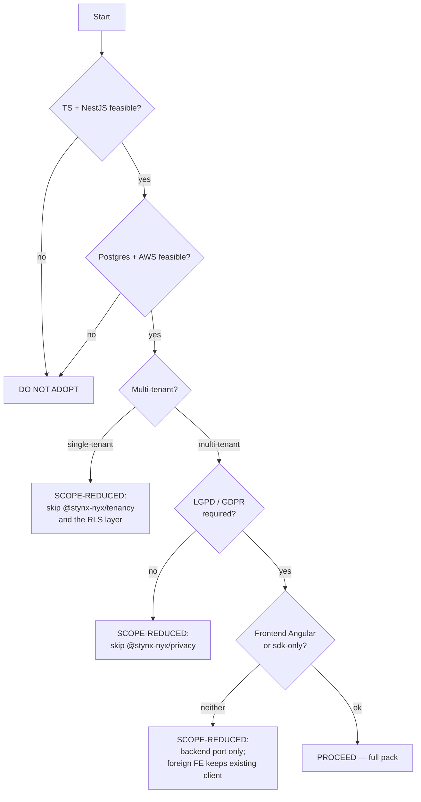

# 02 — Is STYNX Right for You?

A consuming agent must evaluate, on behalf of its operators, whether
porting onto STYNX is appropriate. STYNX is opinionated and
expensive to fight; the cost of adopting where it doesn't fit is
larger than the cost of declining cleanly.

## Strong fit when

- **Multi-tenant SaaS** with shared-DB tenancy (or migrating to it
  from per-tenant schemas).
- **TypeScript backend already in use, or team is comfortable
  adopting it** (the ecosystem is TypeScript-only).
- **NestJS backend, or willingness to adopt NestJS** (decorators,
  guards, interceptors are NestJS-shaped).
- **PostgreSQL, or willingness to migrate to it** — RLS and the
  trigger audit are PostgreSQL-specific.
- **AWS deployment target** — the spec assumes Cognito, S3, RDS,
  ElastiCache, ECS Fargate; CDK skeleton ships ready.
- **Need for built-in LGPD/GDPR data subject pipelines** (export +
  erasure across live and archive).
- **Soft-delete with auditable restore** is a product requirement
  (e.g., trash UIs, undo flows, compliance retention).

## Poor fit when

- **Single-tenant app** — STYNX's tenancy invariants and RLS plumbing
  add cost without value.
- **Non-PostgreSQL database** (MySQL, SQLite, DynamoDB, MongoDB) —
  RLS, the archive trigger model, and Drizzle's PG dialect are core
  assumptions.
- **Non-NestJS backend that cannot be replaced** (Express raw, Koa,
  Fastify outside Nest, Rails, Django, .NET) — the decorator model
  and CLS-based tenant context are NestJS-specific.
- **Strict relationship-based authz needs** (ReBAC / Zanzibar /
  ABAC) — STYNX is RBAC only.
- **Targeting non-AWS cloud** (GCP, Azure, on-premise) — Cognito is
  the IdP and AWS primitives are baked in.
- **Native mobile-only frontend** — no native shell support in v1.0;
  if the only client is iOS/Android, you can integrate with the
  backend but won't get the `@stynx-nyx/*` UI benefit.
- **API-key / M2M-only product** — v1.0 doesn't issue API keys;
  every request is a user session.

## Compatibility check (10 yes/no questions)

Apply each to the foreign codebase and record the answer.

1. Is the backend already TypeScript, or migratable to TypeScript
   within the porting scope?
2. Is it on NestJS, or replaceable with NestJS?
3. Is the database PostgreSQL (any version supporting RLS — 9.5+)?
4. Is the deployment target AWS, or migratable to AWS?
5. Are tenants currently expressed as a column on most domain
   tables (vs schema-per-tenant or DB-per-tenant)?
6. Is identity already federated to Cognito, or is the team willing
   to adopt Cognito as the IdP (with optional SAML federation
   underneath)?
7. Is the existing soft-delete (if any) implemented with
   `deleted_at` on live tables, and is the team willing to migrate
   to archive-schema soft-delete?
8. Is the frontend Angular, or is the team willing to either
   (a) migrate to Angular or (b) consume `@stynx-nyx/sdk` from a
   non-Angular client?
9. Is the team prepared to adopt strict CI gates (commitlint,
   `stynx doctor`, migration linter, branch protection,
   CODEOWNERS)?
10. Is there an LGPD/GDPR data-subject requirement that justifies
    the privacy pipeline cost?

### Scoring

| Yes count | Verdict                                                                                                                           |
| --------- | --------------------------------------------------------------------------------------------------------------------------------- |
| 8–10      | **STRONG FIT** — proceed to [`11-PORTING-PLAYBOOK.md`](11-PORTING-PLAYBOOK.md).                                                   |
| 5–7       | **SCOPE-REDUCED FIT** — port only the layers that match. Skip incompatible packages (e.g., `@stynx-nyx/privacy` if no LGPD need). |
| 0–4       | **DO NOT ADOPT** — the value capture is too small relative to the architectural cost.                                             |

## Decision tree

## Honest red flags

If any of these are true, weight the verdict toward DO NOT ADOPT:

- **The team has strong opinions against opinionated frameworks.**
  STYNX is opinionated by design; teams that fight invariants
  will spend more time disabling them than benefiting from them.
- **The application is in active feature-development crunch.** The
  port is a multi-week effort; doing it under a release deadline
  is the worst time.
- **The data layer has many cross-tenant joins** that don't fit
  pool + RLS cleanly. The cost of unwinding those joins may exceed
  the benefit of adopting RLS.
- **The team's Postgres expertise is shallow.** RLS, GUCs, and
  trigger-based audit are advanced features; debugging requires
  comfort with `pg_stat_*`, `EXPLAIN`, and partition management.
- **The audit findings register
  (`internal work note (not published)`) lists active BLOCKERs
  in areas you depend on** (e.g., FIND-004 migration linter,
  FIND-010 privacy I3). Wait for those to close, or accept the risk
  explicitly.

## What the consuming agent should do

If the verdict is PROCEED or SCOPE-REDUCED FIT:

- Continue to [`11-PORTING-PLAYBOOK.md`](11-PORTING-PLAYBOOK.md)
  Phase 0 — produce `./adoption/ASSESSMENT.md` in the foreign repo.

If the verdict is DO NOT ADOPT:

- Report to operators, citing which compatibility-check questions
  failed. Do not begin the port.
