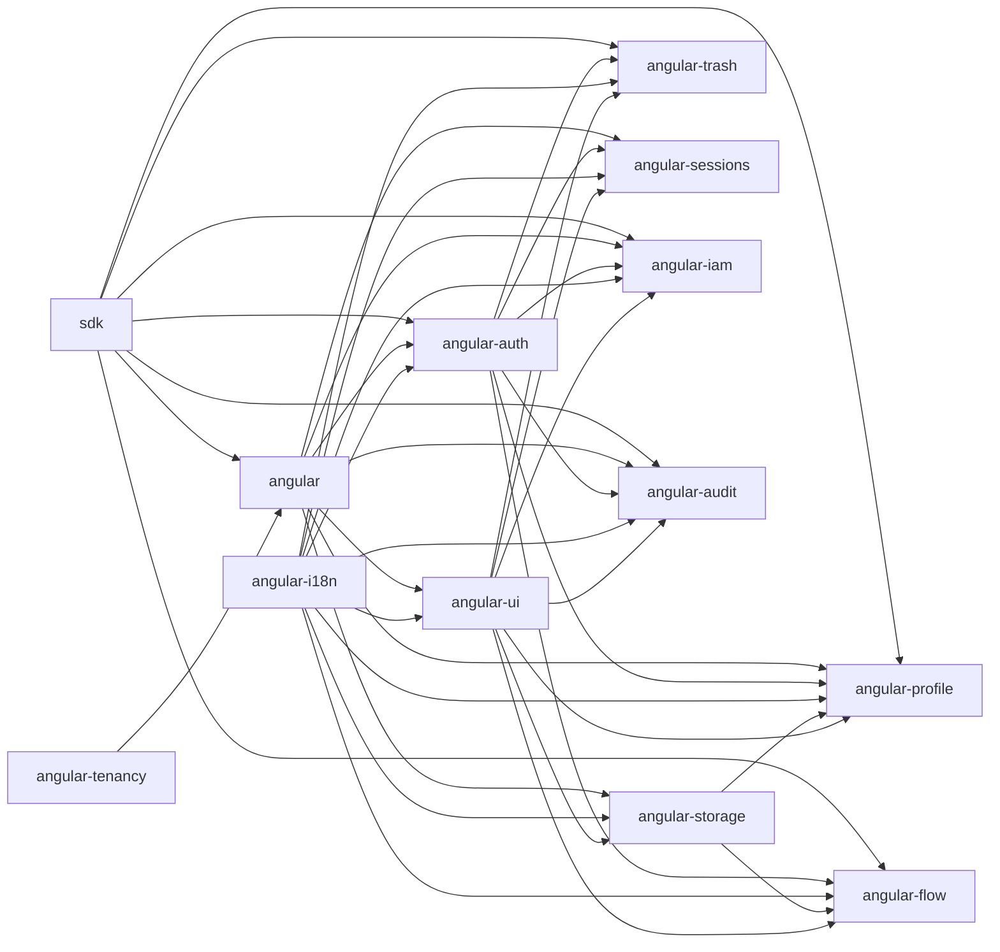

# STYNX Web Packages

`packages-web/` contains the Angular 20 and TypeScript client package family for STYNX applications. The suite is layered: `@stynx-web/sdk` owns framework-agnostic HTTP, auth, tenant, and generated API access; `@stynx-web/angular` adapts that foundation to Angular providers and interceptors; feature packages add auth, tenancy, i18n, UI, storage, trash, sessions, profile, IAM, audit, and Flow screens.

## Install Matrix

| App need                                                               | Install                                                  |
| ---------------------------------------------------------------------- | -------------------------------------------------------- |
| Typed STYNX HTTP client without Angular                                | `pnpm add @stynx-web/sdk`                                |
| Angular core providers, request IDs, auth/tenant/error interceptors    | `pnpm add @stynx-web/angular @stynx-web/angular-tenancy` |
| OIDC login, STYNX session exchange, permission guards                  | `pnpm add @stynx-web/angular-auth`                       |
| Runtime catalogs, locale switching, translate and intl pipes           | `pnpm add @stynx-web/angular-i18n`                       |
| Shared banners, tables, pagination, toast, icons, empty/loading states | `pnpm add @stynx-web/angular-ui`                         |
| Document upload/download and multipart upload execution                | `pnpm add @stynx-web/angular-storage`                    |
| Soft-delete review, restore, and hard-delete UI                        | `pnpm add @stynx-web/angular-trash`                      |
| Active session display/revocation UI                                   | `pnpm add @stynx-web/angular-sessions`                   |
| Profile, preferences, security, and hosted-auth action screens         | `pnpm add @stynx-web/angular-profile`                    |
| IAM user, role, group, membership, and permission screens              | `pnpm add @stynx-web/angular-iam`                        |
| Audit log, event detail, entity history, and hash integrity screens    | `pnpm add @stynx-web/angular-audit`                      |
| Flow design, runtime, task, waiver, fill, and analytics screens        | `pnpm add @stynx-web/angular-flow`                       |

## Architecture



## Five-Minute Quickstart

The FE-H starter contract is `tools/create-stynx-app`. From the repository root:

```bash
node tools/create-stynx-app/bin.mjs my-stynx-app
cd my-stynx-app
pnpm start
```

The generated app should bootstrap `provideStynxDefaults(...)`, then pass supported feature provider bundles such as auth and i18n through that core helper. Other feature providers can sit beside it in the same `providers` array.

```ts
import { bootstrapApplication } from '@angular/platform-browser';
import { provideRouter } from '@angular/router';
import { provideStynxDefaults } from '@stynx-web/angular';
import { provideStynxAuth } from '@stynx-web/angular-auth';
import { StynxI18nModule } from '@stynx-web/angular-i18n';
import { importProvidersFrom } from '@angular/core';

bootstrapApplication(AppComponent, {
  providers: [
    provideRouter(routes),
    provideStynxDefaults({
      angular: {
        apiBaseUrl: '/api',
        sessionMode: 'bearer',
      },
      auth: provideStynxAuth(authOptions),
      i18n: importProvidersFrom(StynxI18nModule.forRoot(i18nOptions)),
    }),
  ],
});
```

Use [`reference/web`](../reference/web/README.md) as the full showcase and each package README for package-specific install, peer dependencies, snippets, and public surface notes.

## Package Index

- [`@stynx-web/sdk`](sdk/README.md)
- [`@stynx-web/angular`](angular/README.md)
- [`@stynx-web/angular-auth`](angular-auth/README.md)
- [`@stynx-web/angular-tenancy`](angular-tenancy/README.md)
- [`@stynx-web/angular-i18n`](angular-i18n/README.md)
- [`@stynx-web/angular-ui`](angular-ui/README.md)
- [`@stynx-web/angular-storage`](angular-storage/README.md)
- [`@stynx-web/angular-trash`](angular-trash/README.md)
- [`@stynx-web/angular-sessions`](angular-sessions/README.md)
- [`@stynx-web/angular-profile`](angular-profile/README.md)
- [`@stynx-web/angular-iam`](angular-iam/README.md)
- [`@stynx-web/angular-audit`](angular-audit/README.md)
- [`@stynx-web/angular-flow`](angular-flow/README.md)
